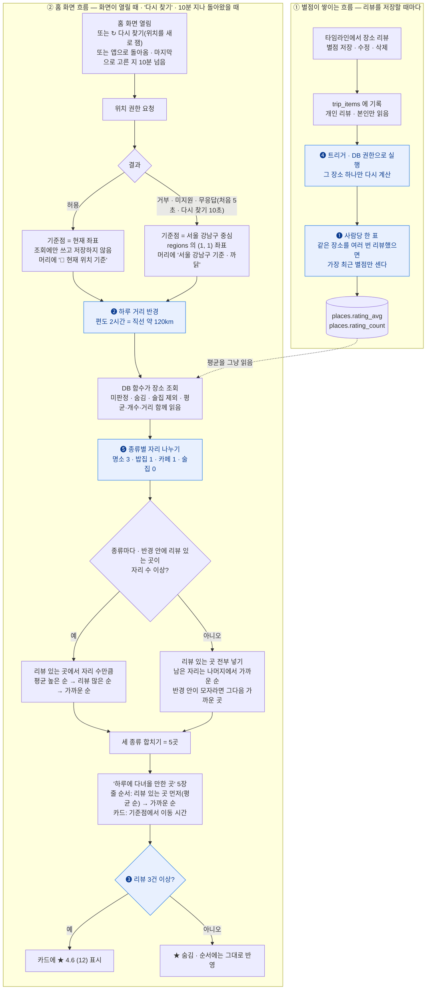
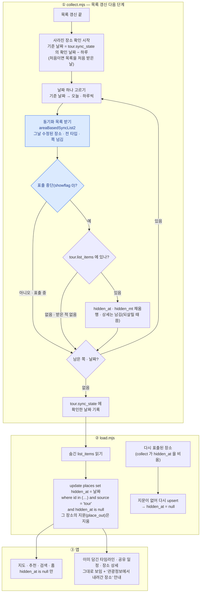

# 홈 '하루에 다녀올 만한 곳' · 장소 업데이트 — 로직

> 홈 화면 '하루에 다녀올 만한 곳' 섹션이 장소 5곳을 고르는 방식입니다. 뒤에
> [여행정보 · 장소 업데이트 흐름](#여행정보--장소-업데이트-흐름)도 함께 둡니다.
>
> 결정 ❶~❺ 그대로 구현돼 있습니다.
> DB 는 `supabase/migrations/20261008010000_place_ratings_and_home_picks.sql`
> (+ 가까운 순 · 종류별 자리 `20261008020000_home_picks_nearest_mix.sql`,
> 숨긴 장소 제외 `20261010000000_place_hidden_at.sql`),
> 화면은 `src/pages/HomePage.tsx`, 조회는 `places.homePicks()`(`src/lib/db.ts`).

## 흐름

### 규칙 한눈에

| # | 규칙 | 값 |
|---|---|---|
| 1 | 기준점 | 현재 위치. 거부 · 미지원 · 5초 무응답이면 서울 강남구 중심. 어느 쪽인지 섹션 머리에 보이고 '↻ 다시 찾기'로 새로 잰다 |
| 2 | 후보 | 미판정 장소 · 숨긴 장소(`hidden_at`) · 술집 제외 |
| 3 | 종류별 자리 | 명소 3 · 밥집 1 · 카페 1 |
| 4 | 종류 안 1순위 | 하루 거리(직선 120km) 안에서 리뷰 있는 곳 — 평균 높은 순 → 리뷰 많은 순 → 가까운 순 |
| 5 | 종류 안 2순위 | 나머지 — 기준점에서 가까운 순(거리 제한 없음) |
| 6 | 카드 줄 순서 | 리뷰 있는 곳 먼저(평균 순), 그다음 가까운 순 |
| 7 | ★ 표시 | 리뷰 3건 이상일 때만. 1~2건도 순서에는 반영. 홈 · 장소 상세 · 지도 시트 · 추천 장소가 같은 규칙(`shownRating()`) |
| 8 | 별점 집계 | 사람당 가장 최근 한 표, 리뷰가 바뀔 때마다 트리거가 계산 |
| 9 | 이동 시간 | 도로 = 직선 × 1.3. 걸어서 15분 안이면 '도보'(4km/h), 아니면 '차로' — 처음 10km 는 30km/h, 나머지는 80km/h. 30분 넘으면 5분 단위 |

두 흐름이 만나는 곳은 점선 한 줄입니다. 홈은 다른 사람의 리뷰를 읽지 않고, 미리
계산해 둔 장소 평균만 읽습니다. 개별 리뷰는 `trip_items` 밖으로 나가지 않습니다.

## 확정한 결정

- **❶ 사람당 한 표** — 같은 사람이 같은 장소에 여러 번 별점을 주면 가장 최근 것만
  평균에 들어갑니다. 한 사람이 같은 곳을 여러 번 리뷰해 평균을 혼자 끌어올리지
  못하게 합니다.
- **❷ 하루 거리** — 편도 2시간, 직선 약 120km. 리뷰 있는 장소가 앞에 서는 범위입니다.
  남은 자리는 거리순이라 반경 안이 모자라면 그다음 가까운 곳이 이어서 들어옵니다.
  앱의 기존 이동 속도(차 30km/h)는 하루 일정 안의 시내 이동용이라 쓰지 않습니다.
  그대로 쓰면 반경이 46km 로 너무 좁습니다. 도시 사이 이동은 평균 80km/h ·
  우회 계수 1.3 으로 잡았습니다.
- **❸ ★ 표시** — 리뷰 3건 이상인 장소만 카드에 별점을 보입니다. 1~2건인 장소도
  순서에는 반영됩니다. 리뷰가 1건뿐이면 평균이 곧 그 사람의 별점이라서입니다.
- **❹ 트리거로 계산** — 리뷰가 바뀔 때마다 DB 트리거가 그 장소의 평균·개수를 다시
  계산해 `places` 에 저장합니다. 이유와 다른 방식을 택하지 않은 까닭은 아래에 있습니다.

그 밖에 정한 것:

- 위치 권한은 화면이 열릴 때 바로 묻습니다. 거부 · 미지원 · 5초 안에 응답이 없으면
  서울 강남구 중심을 기준점으로 삼아 **같은 흐름을 그대로** 탑니다.
- **기준을 보여 주고 다시 찾게 합니다.** 섹션 머리에 '📍 현재 위치 기준' 또는 '서울 강남구
  기준 · 위치 권한이 꺼져 있어요(찾지 못했어요)'가 보이고, '↻ 다시 찾기'는 브라우저가 기억한
  위치를 쓰지 않고 새로 재서(10초까지 기다림) 다시 고릅니다 — 권한 창에서 5초 넘게 늦게
  허용했거나, 거부했다가 설정에서 허용했거나, 자리를 옮긴 경우를 위해서입니다. 권한이 꺼져
  있으면 브라우저가 다시 묻지 않으므로 설정에서 켜는 법을 한 줄 덧붙입니다. 다시 고르는
  동안 지금 카드는 그대로 둡니다.
- 앱으로 돌아왔을 때 마지막으로 고른 지 **10분**이 지났으면 저절로 다시 고릅니다.
- 강남 좌표는 코드에 적지 않고 `regions` 의 (서울 1, 강남구 1) 행에서 읽습니다.
- 리뷰 없는 자리는 **가까운 순**으로 채웁니다. 같은 기준점이면 늘 같은 곳이 나오는 것은
  받아들였습니다.
- **❺ 종류별 자리** — 명소 3 · 밥집 1 · 카페 1, 술집은 넣지 않습니다. 가까운 순으로만
  고르면 반경 수백 m 안의 식당·카페만 나와 동네 맛집 목록이 됐습니다.
- 사용자 평균은 `rating_avg` · `rating_count` 에 둡니다. TourAPI 는 평점을 주지 않습니다.
- 화면 이름은 '하루에 다녀올 만한 곳'입니다 — 인기 순위가 아니라 거리와 리뷰로 고르기 때문입니다.

## ❹ 별점은 트리거로 계산한다

계산 로직(사람당 한 표로 평균·개수)은 SQL 함수 하나이고, 갈리는 것은 그 함수를
언제 부르느냐였습니다. **가. 트리거**로 정했습니다.

| 언제 부르나 | 평균이 틀어질 수 있나 | 메모 |
|---|---|---|
| **가. 트리거** — 리뷰가 바뀔 때마다 ✅ | 아니오 | 위 흐름도의 ① 묶음. 코스 만족도가 이미 같은 방식 |
| 나. 읽을 때 계산 — 저장 칸 없이 조회 함수 안에서 | 아니오 | 평균이 필요한 화면마다 같은 계산을 돎 |
| 다. 앱이 저장 뒤에 호출 | 예 | 여행 삭제 · 탈퇴 · 장소 삭제로 리뷰가 지워질 때 놓침 |
| 라. 브라우저가 직접 계산해 저장 | 예 | 남의 리뷰를 못 읽고(RLS), `places` 쓰기를 열어야 해 위조 가능 |

트리거를 고른 이유:

- **평균이 틀어지지 않습니다.** 리뷰는 화면에서 지울 때만 사라지지 않습니다. 여행을
  지우면 그 안의 리뷰가 함께 지워지고(cascade), 탈퇴하면 그 사람의 리뷰가 전부
  지워지고, 관리자가 장소를 지우면 그 장소의 리뷰도 지워집니다. 이 삭제들은 DB 안에서 일어나 앱
  코드가 알 수 없지만, 트리거는 모두 받습니다.
- **읽는 쪽이 단순해집니다.** 홈 · 추천 · 지도가 저장된 평균을 그냥 읽습니다.
- **이미 쓰는 방식입니다.** 코스 만족도(`shared_plans.rating_avg`)가 같은 트리거
  구조라, 같은 원칙으로 만들고 같은 방법으로 검증합니다.

지키는 것:

- 트리거 함수는 **DB 권한(security definer)으로 돌아야** 합니다. 저장한 사람의
  권한으로 돌면 RLS 때문에 그 사람 자신의 리뷰만으로 평균을 내는데, 오류 없이 틀린
  값이 들어갑니다. `search_path` 도 고정합니다.
- **그 장소 하나만** 다시 계산합니다. 별점이 바뀐 행의 `place_id` 로 범위를 좁히고,
  `trip_items_place_idx`(REVIEW-08 에서 넣은 외래키 인덱스)를 탑니다.
- 리뷰 저장 · 수정 · 삭제와 별점 칸 변경, 그리고 cascade 로 지워지는 경우를 모두
  받도록 `insert` · `update of rating` · `delete` 에 겁니다.
- 마이그레이션에서 **이미 남긴 리뷰로 한 번 채워 넣습니다.** 장소 반영(`load.mjs`)
  upsert 는 이 두 칸을 건드리지 않으므로 재수집해도 평균이 사라지지 않습니다.
- 데모 모드는 DB · 트리거가 없으니 **읽을 때** 기기에 저장된 리뷰로 같은 계산
  (사람당 최근 한 표)을 합니다. 데모 리뷰는 한 기기 안에서만 있어 미리 저장해 둘
  이유가 없습니다.

## 구현 메모

| 무엇 | 어디 |
|---|---|
| 평균 · 개수 칸 | `places.rating_avg`(소수 1자리, 없으면 null) · `places.rating_count`(기본 0) |
| 계산 함수 | `place_rating_recompute(장소 id)` — definer, 아무에게도 실행 권한 없음 |
| 트리거 | `trip_items` 의 insert · delete · `rating`/`place_id` 변경, `trips.trip_date` 변경(최근 한 표가 바뀔 수 있음) |
| 홈 5곳 | `home_picks(위도, 경도, 개수)` — 비회원도 실행. id 와 순서만 돌려주고 장소 행은 앱이 따로 읽음 |
| 거리 | `distance_km()` — 하버사인, 앱의 `distanceKm()` 와 같은 식. `home_picks()` 가 호출자 권한으로 부르므로 anon · authenticated 에 실행 권한을 명시(`20261008030000`) |
| 위치 | `locate()`(`src/lib/geo.ts`) — 위치와 못 얻은 까닭(거부 · 시간 초과 · 미지원). 권한 창이 떠 있는 동안 브라우저 타임아웃이 멈추므로 타이머를 따로 겁니다(처음 5초 · 다시 찾기 10초). 다시 찾기는 `maximumAge 0`. 버튼은 홈 '↻ 다시 찾기', 지도 '↻ 내 위치 다시 찾기'(찾는 동안 둘 다 '찾는 중…') |
| 이동 시간 | `dayTripTravel()`(`src/lib/geo.ts`) — 규칙 9 |
| 장소 목록 | `places.list()` — API 가 한 번에 1,000행만 주므로 첫 쪽에서 전체 개수를 받고 나머지 쪽을 나눠 받음. 홈은 이 목록을 쓰지 않고 `home_picks()` 로 5곳만 받음. 지도는 시/도 전체일 때 이름표 없이 점 |
| 지도 내 위치 주변 | '↻ 내 위치 다시 찾기' → `places.list({ near })` — 시/도 필터 대신 내 위치에서 하루 거리(직선 120km, 홈과 같은 `DAY_TRIP_RADIUS_KM`) 안을 **시/도 경계 없이** 가까운 순으로(부산에서 찾으면 양산 · 김해 · 울산도). 서버에는 위도 · 경도 네모로 묻고 원 밖 모서리는 받은 뒤 버림. 결과가 300곳 넘으면 점. 시/도를 고르거나 '하루 거리 120km 안 ✕'를 누르면 꺼지고 그 전 시/도로 돌아감. 좌표는 URL 에 싣지 않고 메모리에만 둠(탭을 옮겼다 와도 유지, 새로고침하면 해제) |

알려진 한계:

- 이동 시간은 직선 거리로 추정한 값입니다. 길 찾기 API 를 쓰지 않습니다. 반경 끝
  (직선 120km)은 카드에 '차로 약 2시간 10분'으로 나옵니다 — 처음 10km 를 시내
  속도로 잡으면서 '편도 2시간'보다 조금 길게 계산됩니다. 반경은 그대로 둡니다.
- 같은 자리에서 열면 늘 같은 다섯 곳입니다. 리뷰가 쌓이면 리뷰 있는 곳이 앞에 섭니다.

## 여행정보 · 장소 업데이트 흐름

> 홈 · 지도 · 추천이 읽는 장소(`places`)가 TourAPI 에서 운영 DB 까지 오는 길입니다.
> 실제 코드(`collect.mjs` · `load.mjs` · `run-daily.sh`) 그대로입니다. **파일을 거치지 않습니다** —
> 원본 · 상태 · 실행 기록 · 연동 로그는 DB 의 `tour` 스키마, 앱이 보는 장소는 `places`.
> 실행 방법은 [수집 폴더 README](intent/2026-09-20-재수집-스키마-교체/README.md), 구조를 정한
> 이유는 [서버 수집 검토](intent/2026-10-09-서버-수집-검토/검토.md) 에 있습니다.

```mermaid
flowchart TD
    subgraph C["① 수집 — collect.mjs · 매일 0시 (launchd → run-daily.sh) · tour_collector 로 접속"]
        C0["0시 자동 실행<br/>키: .key · DB: .db-url<br/>tour.runs 에 시작 기록<br/>화면 출력은 줄마다 tour.run_logs 로"] --> S1["목록 갱신 — 목록 수정일(modifiedtime) 기준<br/>기준 시각 = tour.sync_state − 하루"]:::key
        S1 --> T1["타입 하나 고르기<br/>39 · 12 · 14 · 28 · 38 · 32 · 15 · 25 (8개)"]
        T1 --> T2["전국 목록 한 쪽 받기<br/>areaBasedList2 · 지역 조건 없음<br/>수정일 순(arrange Q) · 100곳"]:::key
        T2 --> T3{"앞 장소보다 수정일이<br/>최신인 장소가 있나?"}
        T3 -- "있음 · 정렬을 믿을 수 없음" --> S3["갱신 적용 안 함<br/>상세 수집은 계속"]
        T3 -- "없음" --> T4{"기준 시각보다 오래된<br/>장소에 닿았나?"}
        T4 -- "아니오 · 다음 쪽 있음" --> T2
        T4 -- "예 · 또는 마지막 쪽" --> T5{"남은 타입이 있나?"}
        T5 -- "있음" --> T1
        T5 -- "없음 · 8타입 끝" --> S4["바뀐 장소를 tour.list_items 에 반영<br/>수정 · 새로 · 시군구 이동<br/>시군구 = areacode → 없으면 법정동 코드<br/>하나도 못 이으면 기준 시각을 앞당기지 않음"]
        S3 --> H1
        S4 --> H1["사라진 장소 — 동기화 목록 날짜별<br/>표출 중단 → list_items.hidden_at<br/>(아래 '사라진 장소 정리')"]
        H1 --> C1["코드표 tour.code_tables<br/>있으면 건너뜀"]
        C1 --> C2{"목록 단위 받음?<br/>tour.list_fetches (시도 · 시군구 · 타입)"}
        C2 -- "없음" --> C3["목록 받기 areaBasedList2<br/>묶음 1(39·12·14) → 2(28·38·32) → 3(15·25)<br/>묶음마다 목록 → 상세"]
        C2 -- "있음" --> C4["건너뜀<br/>바뀐 것은 목록 갱신이 이미 반영"]
        C3 --> C5
        C4 --> C5{"장소마다 상세가 필요?<br/>목록 수정일 vs tour.details.mt"}:::key
        C5 -- "새 장소 · 수정일이 mt 와 다름" --> C6["상세 받기<br/>detailCommon2 + detailIntro2<br/>장소당 2호출 · 한 곳마다 tour.details 에 저장"]
        C5 -- "이미 받음 · 숨긴 장소" --> C7["건너뜀"]
        C6 --> C8{"일일 한도?<br/>약 2,000호출"}
        C8 -- "남음" --> C5
        C8 -- "초과" --> C9["멈춤 · 종료코드 1<br/>다음 날 그 자리에서 이어받음"]
        C7 --> C10
        C9 --> C10["tour.runs 에 결과 · 호출 수 · 오류"]
    end

    subgraph L["② 반영 — load.mjs · 수집 바로 뒤 (한도로 멈춘 날도)"]
        L1["tour.* 읽기<br/>목록 순서 = 수정일 내림차순 → contentid"] --> L2{"좌표가 믿을 만한가?<br/>한국 범위 · COORD_SUSPECT"}
        L2 -- "아니오" --> L9["미판정(-1)으로 격리<br/>사유를 region_note 에"]
        L2 -- "예" --> L3["지역 판정<br/>1 응답의 시군구코드 → 2 주소의 시군구명"]
        L3 -- "못 찾음" --> L9
        L3 --> L4["사람 교정 덮어쓰기<br/>PLACE_REGION_FIX → region_source = manual"]
        L4 --> L5["내용 정리 · 원래 타입은 content_type 에<br/>분류: 39 → 밥집·카페·술집 · 12·14·28·38·32 → 명소<br/>15·25 → 넣지 않음(tour.* 에만)<br/>소개 첫 문장 · 영업시간 · 전화 · 태그"]
        L9 --> L5
        L5 --> L6["지문(hash) 비교<br/>tour.place_out 과 다른 장소만"]:::key
        L6 --> L7{"안전 검사<br/>반영할 장소 ≥ 지금 places 의 90%?"}
        L7 -- "아니오" --> L8["반영 안 함 · tour.runs 에 실패"]
        L7 -- "예" --> D4["한 트랜잭션<br/>지역 · 시/도 통째 · 바뀐 장소만 upsert<br/>숨김은 hidden_at · 지문 갱신"]
        D4 --> D5["TourAPI 행(source = tour)만 갱신<br/>이름 · 주소 · 좌표 · 사진 · 소개 · 영업시간 · 전화 · 태그"]
        D4 --> D6["그대로 두는 것<br/>수동 등록(m-) 행 · manual 로 고친 지역<br/>별점 평균 · 리뷰 · 여행 · 코스"]
        D4 --> D7["tour.runs 에 바뀐 수 · 주소 대조 결과<br/>화면 출력은 tour.run_logs"]
    end

    C10 --> L1
    M["--demo 를 붙이면 데모 모드 데이터<br/>src/lib/seed.ts 도 다시 만든다(앱 코드)"] -.-> L5

    classDef key fill:#e8f0fe,stroke:#1a73e8,color:#0b3d91
```

**업데이트 판단은 목록 수정일 하나로 합니다**(파란 칸). TourAPI 는 장소마다 수정일을
하나만 주고, 그 값이 목록과 상세 공통에 함께 실립니다.

| 응답 | 수정일 | 업데이트 판단에 쓰나 |
|---|---|---|
| 목록 `areaBasedList2` | 있음 — 장소 수정일 | **씀** — 바뀐 장소를 고르고(목록 갱신), 상세를 다시 받을지 정함 |
| 상세 공통 `detailCommon2` | 있음 — 목록과 같은 값 | 안 씀 — 소개 글 · 전화 때문에 받음 |
| 상세 소개 `detailIntro2` | 없음 | — (영업시간 · 주차 · 메뉴) |

`mt` 는 TourAPI 값이 아니라 **상세를 받던 순간의 목록 수정일을 적어 둔 메모**입니다. 목록
수정일이 `mt` 와 다르면 "상세를 받은 뒤에 장소가 고쳐졌다"고 보고 상세를 다시 받습니다.
상세 소개(영업시간 등)만 따로 고쳐졌는지 알 방법은 없어, 장소 수정일이 그것까지
포함한다고 봅니다.

**받는 타입과 앱 분류** — TourAPI 콘텐츠 타입 8개를 모두 받고, 원래 타입
번호는 `places.content_type` 에 남깁니다. '기타'는 개념상 묶음이라 화면에 따로 표시하지 않습니다.

| 타입 | 수집 묶음 | 앱 |
|---|---|---|
| 39 음식점 | 1 | 밥집 · 카페 · 술집 |
| 12 관광지 · 14 문화시설 | 1 | 명소 |
| 28 레포츠 · 38 쇼핑 · 32 숙박 (기타) | 2 | 명소 — 지도 · 추천 · 홈의 명소에 함께 |
| 15 축제공연행사 · 25 여행코스 | 3 | 데이터만(`tour.*`) — places 에 넣지 않음 |

새 타입도 업데이트는 같은 방식입니다 — 처음엔 받은 목록 단위가 없어 시군구 목록과 상세를 받고,
그 뒤로는 매일 목록 갱신이 8개 타입을 모두 봅니다. 화면에 보일 타입을 바꾸려면
`load.mjs` 의 `CONTENT_TYPES` 표 한 줄만 고칩니다.

수집과 반영은 한 번에 이어서 돕니다 — 사람이 손댈 단계가 없습니다.

| 단계 | 언제 | 무엇이 남나 |
|---|---|---|
| ① 수집 | 매일 0시 자동. 먼저 목록 갱신(타입 8개 · 타입당 몇 호출) · 사라진 장소(2~3호출), 그다음 타입 묶음 1 → 2 → 3 순서로 목록 · 상세를 한도(약 2,000호출 = 장소 1,000곳)까지 받고 멈춤 | `tour.*` 원본 · `tour.sync_state` · `tour.runs` · 연동 로그 `tour.run_logs`(30일) |
| ② 반영 | 수집 바로 뒤 자동 | 운영 DB `places`(바뀐 것만) · `regions` · `region_groups` · `tour.place_out` 지문 |

반영은 있는 행을 고쳐 쓰는 upsert 라 운영 DB 의 사용자 데이터(별점 평균 · 리뷰 · 여행 ·
코스)는 그대로 남습니다. 사람이 손댄 것 — 관리자가 등록한 장소(`m-` 접두사)와 지역을
`manual` 로 고친 장소 — 도 덮지 않습니다. 수집 작업의 DB 역할(`tour_collector`)에는 그렇게
묶인 권한만 있습니다 — 지우는 권한도 없습니다.

### 남은 빈틈

- **완전히 지워진 장소는 모릅니다.** 표출 중단은 동기화 목록으로 잡지만(아래), 동기화 목록에도
  안 나오고 사라진 장소는 알 방법이 없습니다 — 드물다고 보고 둡니다.
- **상세 소개만 바뀐 것은 모릅니다.** `detailIntro2`(영업시간 등)에는 수정일이 없어, 장소 수정일이
  그것까지 포함한다고 봅니다.
- **시군구를 못 정한 새 장소는 건너뜁니다.** 목록 갱신 응답에 시군구 코드가 비어 있으면 법정동
  코드로 찾고, 그래도 없으면 연동 로그에 `?` 줄로 코드를 남깁니다.
- **Mac 이 켜져 있어야 돕니다.** 매일 실행은 Mac 의 launchd 입니다 — 서버(GitHub Actions)로 옮기는
  것은 [검토](intent/2026-10-09-서버-수집-검토/검토.md) 6단계.
- **일일 한도(약 2,000호출)로 상세가 하루 1,000곳씩만 찹니다.** 운영계정 전환으로 늘릴 수 있습니다.

### 사라진 장소 정리

TourAPI 는 장소를 지우지 않고 **표출 중단(showflag 0)** 으로 돌립니다. 그런 장소는 일반
목록(`areaBasedList2`)에 더는 나오지 않아 우리 목록 갱신으로는 알 수 없고, **동기화 목록
(`areaBasedSyncList2`)** 에만 표출 여부와 함께 나옵니다. 그래서 목록 갱신 바로 뒤에 날짜별로
동기화 목록을 받아 표출 중단된 장소를 골라냅니다. 지우지 않고 **숨깁니다** — 지우면 그
장소가 담긴 사용자 타임라인 항목이 cascade 로 사라집니다.

| 항목 | 내용 |
| --- | --- |
| DB | `20261010000000_place_hidden_at` — `places.hidden_at timestamptz`(null = 보임) · `home_picks()` 에 조건 한 줄. 관리자 등록(`m-`) 행은 건드리지 않음 |
| 안전장치 | 응답 수정일이 물은 날짜가 아니거나 showflag 칸이 없으면 아무것도 바꾸지 않음. 실패해도 상세 수집은 계속 |
| 미리보기 | `node collect.mjs --sync-dry` — 목록 갱신과 함께 숨길 · 되살릴 장소를 보여 줌 |
| 호출 수 | 하루 2~3회(어제 · 오늘 · 쪽 넘김). 며칠 쉬었으면 그 날짜 수만큼 |
| 되살림 | 표출이 재개되면 수정일이 바뀌어 목록 갱신에 다시 잡히고, upsert 가 `hidden_at` 을 비움 |
| 확인할 것 | `areaBasedSyncList2` 의 날짜 인자 형식 · 쪽 크기 — 실제 API 로 돈 첫 실행의 연동 로그(`node collect.mjs --log`)로 확인 |
