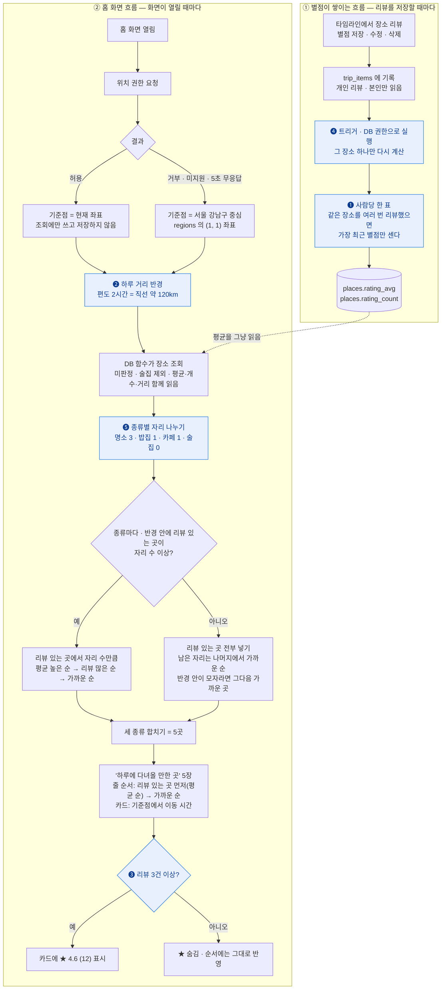
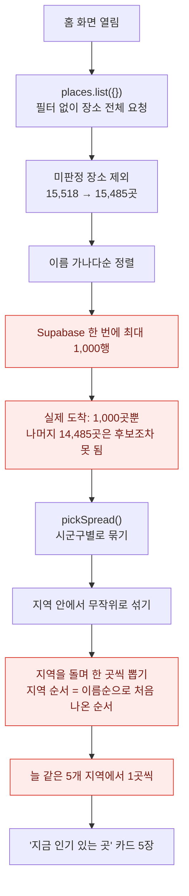

# 지금 인기 있는 곳 — 로직

> 홈 화면 '지금 인기 있는 곳' 섹션이 장소 5곳을 고르는 방식입니다.
>
> 상태: **구현됨** (2026-10-08). 결정 ❶❷❸❹ 그대로입니다.
> DB 는 `supabase/migrations/20261008010000_place_ratings_and_home_picks.sql`
> (+ 가까운 순 · 종류별 자리 `20261008020000_home_picks_nearest_mix.sql`),
> 화면은 `src/pages/HomePage.tsx`, 조회는 `places.homePicks()`(`src/lib/db.ts`).

## 흐름

### 규칙 한눈에

| # | 규칙 | 값 |
|---|---|---|
| 1 | 기준점 | 현재 위치. 거부 · 미지원 · 5초 무응답이면 서울 강남구 중심 |
| 2 | 후보 | 미판정 장소 제외, 술집 제외 |
| 3 | 종류별 자리 | 명소 3 · 밥집 1 · 카페 1 |
| 4 | 종류 안 1순위 | 하루 거리(직선 120km) 안에서 리뷰 있는 곳 — 평균 높은 순 → 리뷰 많은 순 → 가까운 순 |
| 5 | 종류 안 2순위 | 나머지 — 기준점에서 가까운 순(거리 제한 없음) |
| 6 | 카드 줄 순서 | 리뷰 있는 곳 먼저(평균 순), 그다음 가까운 순 |
| 7 | ★ 표시 | 리뷰 3건 이상일 때만. 1~2건도 순서에는 반영 |
| 8 | 별점 집계 | 사람당 가장 최근 한 표, 리뷰가 바뀔 때마다 트리거가 계산 |
| 9 | 이동 시간 | 직선 × 1.3 ÷ 80km/h |

두 흐름이 만나는 곳은 점선 한 줄입니다. 홈은 다른 사람의 리뷰를 읽지 않고, 미리
계산해 둔 장소 평균만 읽습니다. 개별 리뷰는 `trip_items` 밖으로 나가지 않습니다.

## 확정한 결정

- **❶ 사람당 한 표** — 같은 사람이 같은 장소에 여러 번 별점을 주면 가장 최근 것만
  평균에 들어갑니다. 한 사람이 같은 곳을 여러 번 리뷰해 평균을 혼자 끌어올리지
  못하게 합니다.
- **❷ 하루 거리** — 편도 2시간, 직선 약 120km. 리뷰 있는 장소가 앞에 서는 범위입니다.
  남은 자리는 거리순이라 반경 안이 모자라면 그다음 가까운 곳이 이어서 들어옵니다.
  앱의 기존 이동 속도(차 30km/h)는 하루 일정 안의 시내 이동용이라 쓰지 않습니다.
  그대로 쓰면 반경이 46km 로 너무 좁습니다. 도시 사이 이동은 평균 80km/h ·
  우회 계수 1.3 으로 잡았습니다.
- **❸ ★ 표시** — 리뷰 3건 이상인 장소만 카드에 별점을 보입니다. 1~2건인 장소도
  순서에는 반영됩니다. 리뷰가 1건뿐이면 평균이 곧 그 사람의 별점이라서입니다.
- **❹ 트리거로 계산** — 리뷰가 바뀔 때마다 DB 트리거가 그 장소의 평균·개수를 다시
  계산해 `places` 에 저장합니다. 이유와 다른 방식을 택하지 않은 까닭은 아래에 있습니다.

그 밖에 정한 것:

- 위치 권한은 화면이 열릴 때 바로 묻습니다. 거부 · 미지원 · 5초 안에 응답이 없으면
  서울 강남구 중심을 기준점으로 삼아 **같은 흐름을 그대로** 탑니다. 강남 기준이라는
  안내는 따로 두지 않습니다.
- 강남 좌표는 코드에 적지 않고 `regions` 의 (서울 1, 강남구 1) 행에서 읽습니다.
- 리뷰 없는 자리는 **가까운 순**으로 채웁니다(2026-10-08 변경 · 처음엔 지역 무작위).
  같은 기준점이면 늘 같은 곳이 나오는 것은 받아들였습니다.
- **❺ 종류별 자리** — 명소 3 · 밥집 1 · 카페 1, 술집은 넣지 않습니다. 가까운 순으로만
  고르면 반경 수백 m 안의 식당·카페만 나와 동네 맛집 목록이 됐습니다.
- 사용자 평균은 `source_rating` 에 넣지 않고 새 칸(`rating_avg`, `rating_count`)에
  둡니다. `source_rating` 은 "출처(TourAPI)의 평점"이라는 뜻입니다.
- 화면 이름은 '지금 인기 있는 곳' 대신 사실에 맞게 '하루에 다녀올 만한 곳'으로
  바꿉니다.

## ❹ 별점은 트리거로 계산한다

계산 로직(사람당 한 표로 평균·개수)은 SQL 함수 하나이고, 갈리는 것은 그 함수를
언제 부르느냐였습니다. **가. 트리거**로 정했습니다.

| 언제 부르나 | 평균이 틀어질 수 있나 | 메모 |
|---|---|---|
| **가. 트리거** — 리뷰가 바뀔 때마다 ✅ | 아니오 | 위 흐름도의 ① 묶음. 코스 만족도가 이미 같은 방식 |
| 나. 읽을 때 계산 — 저장 칸 없이 조회 함수 안에서 | 아니오 | 평균이 필요한 화면마다 같은 계산을 돎 |
| 다. 앱이 저장 뒤에 호출 | 예 | 여행 삭제 · 탈퇴 · 장소 삭제로 리뷰가 지워질 때 놓침 |
| 라. 브라우저가 직접 계산해 저장 | 예 | 남의 리뷰를 못 읽고(RLS), `places` 쓰기를 열어야 해 위조 가능 |

트리거를 고른 이유:

- **평균이 틀어지지 않습니다.** 리뷰는 화면에서 지울 때만 사라지지 않습니다. 여행을
  지우면 그 안의 리뷰가 함께 지워지고(cascade), 탈퇴하면 그 사람의 리뷰가 전부
  지워지고, 재수집으로 장소가 빠져도 지워집니다. 이 삭제들은 DB 안에서 일어나 앱
  코드가 알 수 없지만, 트리거는 모두 받습니다.
- **읽는 쪽이 단순해집니다.** 홈 · 추천 · 지도가 저장된 평균을 그냥 읽습니다.
- **이미 쓰는 방식입니다.** 코스 만족도(`shared_plans.rating_avg`)가 같은 트리거
  구조라, 같은 원칙으로 만들고 같은 방법으로 검증합니다.

만들 때 지킬 것:

- 트리거 함수는 **DB 권한(security definer)으로 돌아야** 합니다. 저장한 사람의
  권한으로 돌면 RLS 때문에 그 사람 자신의 리뷰만으로 평균을 내는데, 오류 없이 틀린
  값이 들어갑니다. `search_path` 도 고정합니다.
- **그 장소 하나만** 다시 계산합니다. 별점이 바뀐 행의 `place_id` 로 범위를 좁히고,
  `trip_items_place_idx`(REVIEW-08 에서 넣은 외래키 인덱스)를 탑니다.
- 리뷰 저장 · 수정 · 삭제와 별점 칸 변경, 그리고 cascade 로 지워지는 경우를 모두
  받도록 `insert` · `update of rating` · `delete` 에 겁니다.
- 마이그레이션에서 **이미 남긴 리뷰로 한 번 채워 넣습니다.** 장소 적재(`seed.sql`)
  upsert 는 이 두 칸을 건드리지 않으므로 재수집해도 평균이 사라지지 않습니다.
- 데모 모드는 DB · 트리거가 없으니 **읽을 때** 기기에 저장된 리뷰로 같은 계산
  (사람당 최근 한 표)을 합니다. 데모 리뷰는 한 기기 안에서만 있어 미리 저장해 둘
  이유가 없습니다.

## 구현 메모

| 무엇 | 어디 |
|---|---|
| 평균 · 개수 칸 | `places.rating_avg`(소수 1자리, 없으면 null) · `places.rating_count`(기본 0) |
| 계산 함수 | `place_rating_recompute(장소 id)` — definer, 아무에게도 실행 권한 없음 |
| 트리거 | `trip_items` 의 insert · delete · `rating`/`place_id` 변경, `trips.trip_date` 변경(최근 한 표가 바뀔 수 있음) |
| 홈 5곳 | `home_picks(위도, 경도, 개수)` — 비회원도 실행. id 와 순서만 돌려주고 장소 행은 앱이 따로 읽음 |
| 거리 | `distance_km()` — 하버사인, 앱의 `distanceKm()` 와 같은 식. `home_picks()` 가 호출자 권한으로 부르므로 anon · authenticated 에 실행 권한을 명시(`20261008030000`) |
| 위치 | `currentPosition(5000)` — 권한 창이 떠 있는 동안 브라우저 타임아웃이 멈추므로 5초 타이머를 따로 겁니다 |
| 이동 시간 | 카드의 '차로 약 N분' = 직선 × 1.3 ÷ 80km/h |

바꾼 것:

- **남은 자리를 무작위 → 가까운 순으로, 종류별 자리(명소 3 · 밥집 1 · 카페 1)를
  두었습니다** (`20261008020000_home_picks_nearest_mix.sql`). 그러면서 반경 2배(240km) 확장과
  전국 채우기 단계가 필요 없어져 뺐습니다 — 무작위일 때는 후보 묶음이 있어야 해서
  넓혔지만, 거리순이면 다음으로 가까운 곳이 저절로 이어집니다. 무작위 시절에 고친
  난수 쏠림(Postgres 가 같은 `random()` 식을 한 번만 계산해 큰 지역이 앞에 서던
  문제)도 이 변경으로 함께 사라졌습니다.

알려진 한계:

- 가까운 곳도 도시 간 속도(80km/h)로 계산해 '차로 약 1분'처럼 짧게 나옵니다.
  거리순이 되면서 이런 카드가 대부분입니다. 시내 거리는 시내 속도로 나누는 식으로
  다듬을 수 있습니다.
- 같은 자리에서 열면 늘 같은 다섯 곳입니다. 리뷰가 쌓이면 리뷰 있는 곳이 앞에 섭니다.

## 이전 구현의 문제 — 이 설계를 하게 된 이유

이전 홈은 '인기'라는 이름과 달리 인기 순위가 없습니다. TourAPI 에 평점이 없어
지역별로 섞어 무작위로 고르는데, 그마저 의도대로 돌지 않습니다.

1. **1,000행에서 잘립니다.** Supabase API 기본 설정이 한 번에 1,000행입니다.
   이름순으로 앞쪽 장소만 후보가 됩니다.
2. **지역 순서가 섞이지 않습니다.** 늘 이름순으로 앞선 다섯 지역에서만 나옵니다
   (2026-10-08 시드 기준: 인천 제물포·영종, 경남 고성, 충남 금산, 경남 김해, 경기 양평).
3. **5곳을 보여 주려고 매번 1,000행을 내려받습니다.**

홈은 이번 구현으로 이 문제를 벗어났습니다. 같은 1,000행 상한에 걸리던 지도 · 추천
장소 · 방문 조건 화면의 '시/도 전체'(경기 · 강원 · 서울 · 경남 · 경북 · 전남 · 충남)는
`places.list()` 가 1,000행씩 나눠 받도록 고쳤습니다. 지도는 시/도 전체일 때 이름표
없이 점으로 그립니다.
