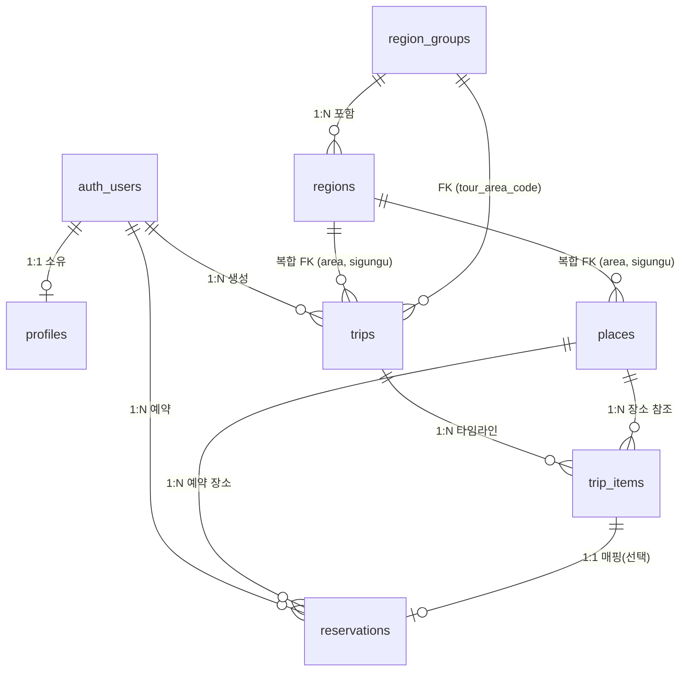

# 하루여행 데이터베이스 검토 보고서

> 작성일: 2026-09-23  
> 대상: `supabase/schema.sql` (스냅샷), `supabase/migrations/`, `src/lib/types.ts`, `src/lib/db.ts`  
> 목적: 현재 데이터베이스 스키마 및 접근 계층 구조 분석, 잠재 리스크 진단, 향후 기능 확장(플랜 공유 등) 대비 개선점 도출

---

## 1. 개요 및 아키텍처 요약

하루여행(oneday-trip)의 데이터베이스는 **Supabase(PostgreSQL)** 기반으로 구축되어 있으며, **"당일치기 위치기반 여행 일정 및 맛집 지도 서비스"**라는 도메인에 고도로 최적화되어 있습니다.

- **테이블 수**: 7개 (`profiles`, `region_groups`, `regions`, `places`, `trips`, `trip_items`, `reservations`)
- **사용자 정의 ENUM**: 5개 (`place_category`, `transport_type`, `trip_item_status`, `reservation_status`, `region_source_kind`)
- **보안(RLS)**: 전 테이블 RLS 활성화 (공개 카탈로그와 개인 소유 데이터 격리)
- **실시간(Realtime)**: `trip_items` 테이블 실시간 구독 활성화



---

## 2. 테이블별 상세 구조 및 역할 분석

### 2.1 회원 및 프로필 도메인

#### `public.profiles`
```sql
create table public.profiles (
  id         uuid primary key references auth.users on delete cascade,
  nickname   text not null check (char_length(nickname) between 2 and 12),
  taste_tags text[] not null default '{}',
  created_at timestamptz not null default now()
);
```
- **역할**: 사용자 기본 프로필 및 선호 취향 태그(SYS-01-02) 관리.
- **특징 (온보딩 지연 생성 패턴)**:
  - `auth.users` 가입 시 트리거로 행을 자동 생성하지 않습니다.
  - 앱은 `profiles` 행의 부재를 "온보딩 미완료" 신호로 감지하여 온보딩 화면으로 안내합니다.
  - 소셜 로그인 시 긴 닉네임이나 이메일 부재 등으로 트리거가 실패해 회원가입 전체가 차단되는 문제를 원천 방지합니다.

---

### 2.2 지리 및 행정구역 도메인

#### `public.region_groups` (상위 지역: 시/도) & `public.regions` (하위 지역: 시군구)
```sql
create table public.region_groups (
  tour_area_code  smallint primary key,
  name            text not null unique,
  lat             double precision not null,
  lng             double precision not null,
  sort_order      smallint not null default 0,
  created_at      timestamptz not null default now()
);

create table public.regions (
  tour_area_code     smallint not null references public.region_groups(tour_area_code),
  tour_sigungu_code  smallint not null,
  name               text not null,
  ldong_cd           text,
  lat                double precision not null,
  lng                double precision not null,
  sort_order         smallint not null default 0,
  created_at         timestamptz not null default now(),
  primary key (tour_area_code, tour_sigungu_code),
  unique (tour_area_code, name)
);
```
- **역할**: 2단계 드롭다운 지역 선택(TRIP-02-01, MAP-04-01) 지원.
- **설계 핵심**:
  - **TourAPI 코드 복합키 채택**: 문자열 지명 대신 `(tour_area_code, tour_sigungu_code)`를 식별자로 사용하여, '강서구'(서울/부산) 같은 동음이의어 충돌 방지 및 행정구역 개칭 시 무중단 UPDATE 가능.
  - **법정동 코드(`ldong_cd`) 보관**: 타 공공데이터 및 외부 지도 API와의 확장 연계 키 확보.
  - **미판정 센티넬(`-1`) 격리 구조**: 시군구 판정 실패 시 버리지 않고 `(N, -1)` 또는 `(-1, -1)` 행에 보관하며, 사용자 쿼리에서는 `tour_sigungu_code >= 0` 조건으로 은닉.

---

### 2.3 장소 카탈로그 도메인

#### `public.places`
```sql
create table public.places (
  id                 text primary key,          -- TourAPI contentid
  name               text not null,
  category           place_category not null,
  tour_area_code     smallint not null,
  tour_sigungu_code  smallint not null,
  address            text not null,
  lat                double precision not null,
  lng                double precision not null,
  image_url          text,
  source_rating      numeric(2,1) check (source_rating between 0 and 5),
  price_level        smallint not null default 2 check (price_level between 1 and 4),
  tags               text[] not null default '{}',
  summary            text not null default '',
  open_hours         text not null default '',
  phone              text,
  source_modified_at text,
  region_source      region_source_kind not null default 'tour',
  region_note        text,
  created_at         timestamptz not null default now(),
  foreign key (tour_area_code, tour_sigungu_code)
    references public.regions (tour_area_code, tour_sigungu_code)
);
```
- **역할**: 전국 음식점/카페/술집/명소 카탈로그 (한국관광공사 KorService2 기반).
- **자동 판정 및 트리거 제어**:
  - `places_mark_region_manual()` 트리거: 일반 UPDATE로 지역 변경 시 `region_source := 'manual'` 자동 전환.
  - 배치 파이프라인 대응: 대량 동기화 시 `set local app.region_batch = 'on'`으로 트리거를 우회하도록 설계.
- **평점 정책**: 공공데이터에 평점이 없는 경우 0점이 아닌 `null`로 기록하여 '평점 없음'과 '0점'의 의미적 분리 달성.

---

### 2.4 여행 일정 도메인 (당일치기 특화)

#### `public.trips` (여행 마스터)
```sql
create table public.trips (
  id                 uuid primary key default gen_random_uuid(),
  user_id            uuid not null references auth.users on delete cascade,
  title              text not null,
  tour_area_code     smallint not null references public.region_groups(tour_area_code),
  tour_sigungu_code  smallint,
  trip_date          date not null,
  start_time         time not null default '09:00',
  end_time           time not null default '20:00',
  companions         text[] not null default '{}',
  transport          transport_type not null default 'transit',
  created_at         timestamptz not null default now(),
  constraint trips_region_fkey foreign key (tour_area_code, tour_sigungu_code)
    references public.regions (tour_area_code, tour_sigungu_code)
);
```
- **역할**: 당일치기 일정 기본 설정 및 제약조건(TRIP-02-01, TRIP-02-02).
- **PostgreSQL MATCH SIMPLE 특성 활용**:
  - `tour_sigungu_code`가 NULL인 경우 '시/도 전체'를 뜻하며, 복합 FK 컬럼 중 하나가 NULL이면 참조 무결성 검사를 건너뛰는 RDBMS 표준 동작을 영리하게 활용함.

#### `public.trip_items` (타임라인 항목 및 방문 후기)
```sql
create table public.trip_items (
  id           uuid primary key default gen_random_uuid(),
  trip_id      uuid not null references public.trips on delete cascade,
  place_id     text not null references public.places on delete cascade,
  sort_order   smallint not null default 0,
  planned_time time,
  status       trip_item_status not null default 'planned',
  note         text,
  rating       smallint check (rating between 1 and 5),
  created_at   timestamptz not null default now()
);
```
- **역할**: 하루 일정 내 방문 순서(`sort_order`)와 방문 후기(한 줄 소감 `note`, 별점 `rating`).
- **실시간성**: `supabase_realtime`에 등록되어 카드 상태 변경이나 순서 최적화 시 클라이언트에 즉시 동기화.

---

### 2.5 예약 도메인

#### `public.reservations`
```sql
create table public.reservations (
  id           uuid primary key default gen_random_uuid(),
  user_id      uuid not null references auth.users on delete cascade,
  place_id     text not null references public.places on delete cascade,
  trip_item_id uuid references public.trip_items on delete set null,
  reserved_at  timestamptz not null,
  party_size   smallint not null check (party_size between 1 and 12),
  deposit      integer not null default 0,
  status       reservation_status not null default 'confirmed',
  created_at   timestamptz not null default now()
);
```
- **역할**: 레스토랑 예약(RSV-05-01). 일정 타임라인 항목(`trip_item_id`)과 1:1로 연결되어 타임라인 카드에 '예약 확정' 배지를 자동 노출.

---

## 3. 보안 정책 (Row Level Security) 검토

| 테이블 | 권한 정책 | 대상 사용자 | 조건식 |
|---|---|---|---|
| `region_groups` | `SELECT` | 누구나 (Guest 포함) | `true` |
| `regions` | `SELECT` | 누구나 (Guest 포함) | `true` |
| `places` | `SELECT` | 누구나 (Guest 포함) | `true` |
| `profiles` | `ALL` | 인증된 본인 | `auth.uid() = id` |
| `trips` | `ALL` | 인증된 소유자 | `auth.uid() = user_id` |
| `trip_items` | `ALL` | 여행 소유자 | `exists (select 1 from trips t where t.id = trip_id and t.user_id = auth.uid())` |
| `reservations` | `ALL` | 인증된 예약자 | `auth.uid() = user_id` |

- **평가**: 게스트 둘러보기(Guest 모드) 요구사항과 개인정보 격리 원칙이 RLS 정책에 완벽하게 일치합니다.

---

## 4. 진단 결과 및 잠재 리스크 (Issues & Bottlenecks)

### 🔴 1. 외래키(Foreign Key) 인덱스 누락
- **현상**:
  - `trip_items(place_id)` 인덱스 없음
  - `reservations(place_id)` 인덱스 없음
  - `reservations(trip_item_id)` 인덱스 없음
- **영향**:
  1. 부모 테이블(`places`, `trip_items`) 행 삭제 또는 갱신 시 `ON DELETE CASCADE / SET NULL` 무결성 검증을 위해 자식 테이블 전체를 Sequential Scan 하여 심각한 Lock 지연 유발 가능.
  2. "이 장소를 담은 여행 목록" 또는 "이 장소의 예약 현황" 역추적 쿼리 시 성능 급락.
- **해결책**: 외래키 대상 B-Tree 인덱스 생성 필수.

### 🟡 2. 장소명 부분 일치 검색(ILIKE) 인덱스 부재
- **현상**: `src/lib/db.ts`의 장소 검색 쿼리:
  ```typescript
  if (filter.keyword) query = query.ilike('name', `%${filter.keyword}%`)
  ```
- **영향**: 현재 `places` 테이블의 인덱스는 `(tour_area_code, tour_sigungu_code, category)` 복합 인덱스뿐이므로, 키워드 검색 시 앞단 와일드카드(`%...%`)로 인해 B-Tree 인덱스를 탈 수 없어 Full Table Scan 발생.
- **해결책**: PostgreSQL `pg_trgm` 확장 모듈과 GIN 삼중자(Trigram) 인덱스 추가.

### 🟡 3. Check Constraint(무결성 제약조건) 보강 필요
- **`reservations.deposit`**: `integer not null default 0`으로 선언되어 있으나 음수 금액 방지 제약조건 부재 (`check (deposit >= 0)`).
- **`trips.companions`**: `text[]` 배열로 자유 입력이 가능하여 프론트엔드의 `solo`, `couple`, `friends`, `family`, `pet` 이외의 잘못된 문자열 삽입 가능.
- **`trip_item_status` ENUM 잔여값**: `drop_waiting_feature` 마이그레이션으로 웨이팅 기능이 제거되었으나 타입에 `'waiting'` 값이 잔존.

---

## 5. 향후 기능 확장 시 DB 영향도 분석

### 5.1 플랜 공유 기능 (`SHARE-06`) 도입 시
1. **공개 플래그 및 공유 식별자 필요**:
   - `trips`에 `is_public boolean not null default false` 추가.
   - 단축 URL이나 외부 공유를 위한 `share_token text unique` (또는 nanoid) 도입 권장.
2. **RLS 정책 개편 필수**:
   - 현재 `trips`와 `trip_items`는 `auth.uid() = user_id` 조건만 허용하므로 공유 플랜 열람 불가.
   - 변경안:
     ```sql
     -- trips SELECT 정책
     create policy "readable trips" on public.trips for select
       using (auth.uid() = user_id or is_public = true);

     -- trip_items SELECT 정책
     create policy "readable trip items" on public.trip_items for select
       using (
         exists (
           select 1 from public.trips t
           where t.id = trip_id and (t.user_id = auth.uid() or t.is_public = true)
         )
       );
     ```
3. **가져오기(Fork/Import) 트랜잭션**:
   - 남의 공유 플랜을 내 여행으로 복사해오는 로직이 필요하므로, 복사 시 `trip_items`의 방문 후기(`rating`, `note`)와 `status`를 초기화(`planned`)하는 복제 프로시저 또는 클라이언트 일괄 생성 고려.

### 5.2 사용자 리뷰/평점 시스템 활성화 시
- 현재 `places.source_rating`은 TourAPI 수집값(현재 대부분 null).
- `trip_items`에 축적되는 실사용자의 `rating`(1~5)과 `note`를 집계하여 `places`의 자체 평점으로 환산하는 View 또는 트리거 기반 집계 컬럼(`user_rating_avg`, `review_count`) 추가 권장.

---

## 6. 권장 조치 사항 (Action Items)

### [즉시 적용 권장] 성능 보강 마이그레이션 SQL
다음 마이그레이션을 신규 파일(예: `supabase/migrations/20260923000000_performance_indexes.sql`)로 추가하는 것을 권장합니다:

```sql
-- 1. 외래키 인덱스 추가 (Cascade 삭제 성능 및 역방향 조회 최적화)
create index if not exists trip_items_place_idx on public.trip_items (place_id);
create index if not exists reservations_place_idx on public.reservations (place_id);
create index if not exists reservations_trip_item_idx on public.reservations (trip_item_id);

-- 2. 장소 이름 부분 일치 검색용 Trigram 인덱스 추가
create extension if not exists pg_trgm;
create index if not exists places_name_trgm_idx on public.places using gin (name gin_trgm_ops);

-- 3. 예약금 음수 방지 제약 추가
alter table public.reservations
  add constraint reservations_deposit_non_negative check (deposit >= 0);
```
