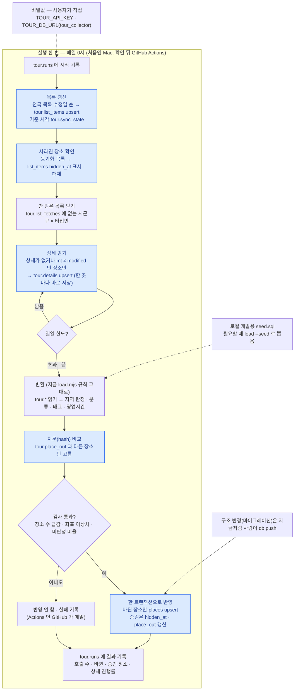

# 장소 업데이트를 서버로 · 파일 대신 DB 로 — 검토 (2026-10-09)

지금은 사용자의 Mac 이 매일 0시(launchd)에 `collect.mjs` 를 돌려 `raw/` 파일에 쌓고,
사람이 `load.mjs` → `seed.sql` 커밋 → `db push --include-seed` 로 운영 DB 에 넣는다.
이 문서는 두 가지를 정한다.

1. **어디서 돌릴까** — Mac 대신 서버
2. **무엇에 쌓을까** — 파일(`raw/` · `seed.sql`) 대신 DB

**진행: 5단계까지 코드 완료 (10/9) — 수집 · 반영 모두 파일 없이 DB 만 쓴다. 운영 반영은 마이그레이션 `20261012000000` 적용 뒤 첫 0시 실행부터. 남은 것: 6(GitHub Actions) · `raw/` 백업 후 삭제.**

## 지금 방식의 문제

| 문제 | 영향 |
| --- | --- |
| Mac 이 꺼지거나 잠들면 수집이 안 돈다 | 9/23~9/30 은 `node` 를 못 찾아 일주일 내내 죽었다 |
| 운영 반영이 사람 손 4단계 | 수집은 매일 되는데 운영 DB 는 사람이 반영할 때만 바뀐다 |
| 상태(`raw/`, 36MB · 파일 1,100여 개)가 Mac 한 대에만 | 잃으면 처음부터(약 2주) |
| 반영이 통째 | 10곳이 바뀌어도 `seed.sql` 5.8MB 를 다시 만들고 15,518곳을 다시 쓴다 · 매번 git 에 커밋 |
| 진행 상황이 파일 속 | `run-daily.sh --status` 로만 본다 — SQL 로 물을 수 없다 |

## 1. 어디서 돌릴까

| | A. GitHub Actions 예약 실행 | B. Supabase Edge Function + pg_cron | C. 별도 Node 서버 | D. Spring 서버 | E. Vercel Cron |
| --- | --- | --- | --- | --- | --- |
| 지금 코드 재사용 | **거의 그대로** | 다시 씀(Deno) · 잘게 나눔 | 그대로 + 스케줄러 | 전부 다시(Java) | 쪼개서 다시 |
| 실행 시간 한도 | 작업당 6시간 | 1회 150초(무료) · 400초(유료) | 없음 | 없음 | 300초 · 하루 1회(Hobby) |
| 비용 | 공개 저장소 무료 · 비공개는 월 무료 분량 안(하루 2~12분) | 무료 플랜 안 | 월 몇 달러~ | C + 메모리 더 | Hobby 는 비상업만 |
| 관리 부담 | 없음(실패하면 GitHub 가 메일) | 낮음 | 서버 업데이트 · 감시 | 가장 큼 | 낮음 |
| 다른 반복 작업 | 워크플로 파일 하나씩 | 함수 하나씩 | 가장 자유로움 | 가장 자유로움 | 하루 1회 제한 |

**권장: A.** D 는 코드가 모두 JavaScript 라 옮길 이유가 없고, E 는 300초 · 하루 1회 ·
비상업 조건에 걸린다. 상시 켜져 있어야 하는 일(API · 웹훅)이 생기면 그때 C 로 — 같은
JavaScript 이고, 아래처럼 상태가 DB 에 있으면 **어디서 돌리든 같은 DB 를 보므로** 옮기기 쉽다.

## 2. 무엇에 쌓을까 — DB

파일은 Mac 한 대에서 돌리던 구조다. 서버로 옮기면 실행마다 36MB 를 내려받고 올려야
하고, 중간에 죽으면 상태가 어긋난다. 그래서 수집 원본과 상태를 DB 의 `tour` 스키마에
둔다.

### 테이블 (`tour` 스키마 — 앱 API 에 열지 않음)

| 지금 파일 | 테이블 | 한 행 | 주요 칸 |
| --- | --- | --- | --- |
| `area-codes.json` · `sigungu-*.json` (18개) | `tour.code_tables` | 코드표 하나 | `name` · `data jsonb` · `fetched_at` |
| `places-시도-시군구-타입.json` 이 **있다는 사실** (702개) | `tour.list_fetches` | 받은 목록 단위 하나 | `area_code` · `sigungu_code` · `content_type` · `fetched_at` |
| `places-*.json` 의 항목 (15,518+) | `tour.list_items` | 장소 하나 | `contentid` (PK) · `content_type` · `area_code` · `sigungu_code` · `modified` · `item jsonb` · `hidden_at` · `updated_at` |
| `detail-*.json` 의 항목 | `tour.details` | 장소 하나 | `contentid` (PK) · `common jsonb` · `intro jsonb` · `mt` · `fetched_at` |
| `hidden.json` | — | `list_items.hidden_at` 으로 흡수 | 행을 지우지 않고 표시만 |
| `sync-state.json` | `tour.sync_state` | 값 하나 | `key` · `value jsonb` |
| `logs/` · `summary.txt` | `tour.runs` | 실행 한 번 | `started_at` · `finished_at` · `calls` · `result jsonb` · `error` |
| (없음) | `tour.place_out` | 앱 장소 하나 | `id` · `hash` · `applied_at` — 지난번 반영한 변환 결과의 지문 |

- **원본 JSON 은 그대로 둔다(`jsonb`).** 태그 · 영업시간 규칙을 바꿔도 API 를 다시 부르지
  않고 `places` 를 다시 만들 수 있어야 한다 — 오늘(10/8)만 규칙을 여러 번 바꿨다.
- **용량.** 시험 적재로 잰 값: 목록 13MB · 상세 19MB(상세 58% 시점). 다 받아도 100MB 안쪽 — Supabase 무료 한도(500MB) 안이다.
- **접근.** `tour` 는 `config.toml` 의 노출 스키마(`public` · `graphql_public`)에 넣지 않고,
  `anon` · `authenticated` 권한을 걷는다. 수집 작업만 전용 역할(`tour_collector`)로
  접속한다 — 비밀번호는 사용자가 만들어 비밀값으로 넣는다.

### 흐름

### 바뀌는 것

| 지금 | DB 처리 뒤 |
| --- | --- |
| `raw/` 파일 1,100여 개 | `tour.*` 테이블 — Mac 의 `raw/` 는 옮긴 뒤 보관만 |
| 목록 파일이 있으면 건너뜀 | `tour.list_fetches` 에 행이 있으면 건너뜀 |
| 상세 파일에 한 곳마다 저장 | `tour.details` 에 한 곳마다 upsert — 중단해도 손실 0 은 그대로 |
| `load.mjs` → `seed.sql` 5.8MB → 커밋 → 사람이 반영 | 바뀐 장소만 `places` 에 바로 반영(평소 하루 수십 곳) |
| `supabase/seed.sql` 을 매번 커밋 | 로컬 개발용으로 가끔만(`load --seed`) |
| 진행 확인: `run-daily.sh --status` | `select * from tour.runs order by started_at desc limit 7` |
| Mac launchd | GitHub Actions — 옮긴 뒤 Mac 예약은 **반드시 끔**(같은 키 한도를 나눠 먹는다) |

### 바꾸지 않는 것

- **변환 규칙은 JavaScript 에 그대로.** 지역 판정 · 주소 대조 · 좌표 이상치 · 태그는 SQL 로
  옮기기엔 복잡하다. `collect.mjs` · `load.mjs` 는 **읽고 쓰는 곳만** 파일 → DB 로 바꾼다.
- **목록 갱신 · 사라진 장소 · 일일 한도 처리 · 안전장치** 규칙도 그대로.
- **`places` 의 사람 데이터 보호** — 수동 등록(`m-`) · 사람이 고친 지역(`manual`) · 별점 칸은
  지금처럼 덮지 않는다.

## 단계 — 한 번에 하나씩, 확인하며

| 단계 | 할 일 | 어디서 | 확인 |
| --- | --- | --- | --- |
| 1 ✓ | 마이그레이션 `20261011000000_tour_collect_schema`: `tour` 스키마 · 테이블 7개 · `tour_collector` 역할(로그인 없이) | 로컬 → 운영 | 마이그레이션 39개 재생 = `schema.sql` · anon 접근 거부 · 역할 읽기쓰기 확인(10/9) |
| 2 ✓ | `import-raw.mjs` · `db.mjs`: 지금 `raw/` 를 `tour.*` 에 한 번 적재 — 운영 적재 · 대조 통과(10/9: 코드표 18 · 목록 파일 702 · 장소 15,518 · 상세 8,998 · 6.5초, Session pooler · TLS 인증서 검증) | Mac | 되읽어 파일과 전부 대조(개수 · 내용) |
| 3 ✓ | `load.mjs` 가 DB 를 읽음(`raw-source.mjs` 가 예전 파일 단위로 묶음) · 목록 순서를 수정일 내림차순으로 고정 — 시험 DB 에서 파일 · DB 두 결과 diff 0줄(10/9) | 시험 DB | 두 결과 diff 0줄 |
| 4 ✓ | `collect.mjs` 가 DB 에만 씀 — 코드표 · 목록 단위 · 목록 · 상세 · 목록 갱신 · 사라진 장소 · 상태 · 실행 기록(`tour.runs`) · `--status`. 파일 코드 제거 — 가짜 API 로 첫 수집 · 한도 중단 · 이어받기 · 갱신(수정/새로/이동/못 찾음) · 숨김/되살림 · 안전장치 확인(10/9) | 시험 DB | `tour.runs` · 진행률 |
| 5 ✓ | `load.mjs` 가 바뀐 장소만 `places` 에 바로 반영(지문 `tour.place_out`) · 안전 검사(90%) · 마이그레이션 `20261012000000_tour_collector_writes`(쓰기 권한 · RLS). `seed.sql` · `import-raw.mjs` 삭제, `config.toml` 시드 끔 — 시험 DB: 첫 반영 후 places 내용 그대로(지문 같음), 둘째 반영 0곳, 상세 1곳 바꾸면 1곳, 숨김/되살림, 관리자 행 못 고침, 급감 시 거부(10/9) | 시험 DB → 운영 | 운영 장소 수 · 바뀐 수 |
| 6 | GitHub Actions 로 옮기고 Mac 예약 끄기 | Actions | 첫 실행 로그 |
| 7 ✓ | 문서 갱신 — `README-플로챠트.md` ① ② · 수집 README · `DATA-MODEL.md` · `README.md` · 디비-갱신-절차(파일 시절 기록으로 표시) (10/9) | — | — |

1~5 는 Mac 에서 하므로 **서버 문제와 DB 전환 문제가 섞이지 않는다.**

## 먼저 확인할 것

1. **해외 IP 에서 TourAPI 가 되는가.** GitHub 실행기는 미국에 있다. 막히면 6단계를 B
   (Supabase 함수 — 서울 리전)나 국내 서버로. 1~5 단계는 영향 없다.
2. **DB 접속 주소.** Supabase 직접 접속 주소는 IPv6 전용이라 GitHub 실행기에서 안 될 수
   있다 → **Session pooler** 주소를 쓴다. Mac 에서도 같은 주소로 시험한다.
3. **비밀값.** `TOUR_API_KEY` · `TOUR_DB_URL` 은 Mac 에선 `.key` 처럼 gitignore 된 파일,
   Actions 에선 Secrets — 둘 다 사용자가 직접 넣는다.
4. **일일 한도.** 개발계정(약 2,000회)이라 첫 수집이 일주일 더 걸린다. 공공데이터포털에서
   운영계정 전환(활용사례 등록)을 신청하면 늘릴 수 있다 — 이 작업과 별개.

## 겪은 일 — 접속 (10/9)

- **사용자 이름.** Connect 창의 주소는 `postgres.<ref>` 다. `tour_collector.<ref>` 로 바꾸지 않으면
  `password authentication failed for user "postgres"`.
- **pooler 가 옛 비밀번호를 기억한다.** `tour_collector` 비밀번호를 짧은 간격으로 여러 번 바꾸자,
  DB 의 비밀번호가 맞는데도 Session pooler 에서만 `password authentication failed` 가 났다.
  30분쯤 두니 풀렸다. 비밀번호를 바꾼 뒤엔 **더 바꾸지 말고 기다린다** — 바꿀 때마다 처음부터.
- **비밀번호가 맞는지 pooler 없이 확인하는 법.** Mac 은 IPv6 가 없어 `db.<ref>.supabase.co` 에
  못 닿는다. 대신 SQL 편집기에서 `dblink` 로 **DB 서버 자신의 외부 주소**에 접속해 본다
  (`host=localhost` 는 비밀번호를 안 물어 dblink 가 거부한다). 확인 뒤 확장은 지운다.
- **비밀번호를 옮겨 적지 않는다.** 터미널에서 만들어 `.db-url` 에 넣고, SQL 문은 `pbcopy` 로
  클립보드에만 — 화면 · 셸 기록 · 채팅에 남지 않는다. 처음 실패는 셸 명령을 SQL 편집기에
  붙여 넣어 `alter role` 이 실행되지 않은 탓이었다.

## 참고

- Supabase Edge Function 한도: https://supabase.com/docs/guides/functions/limits
- GitHub Actions 과금: https://docs.github.com/billing/managing-billing-for-your-products/managing-billing-for-github-actions
