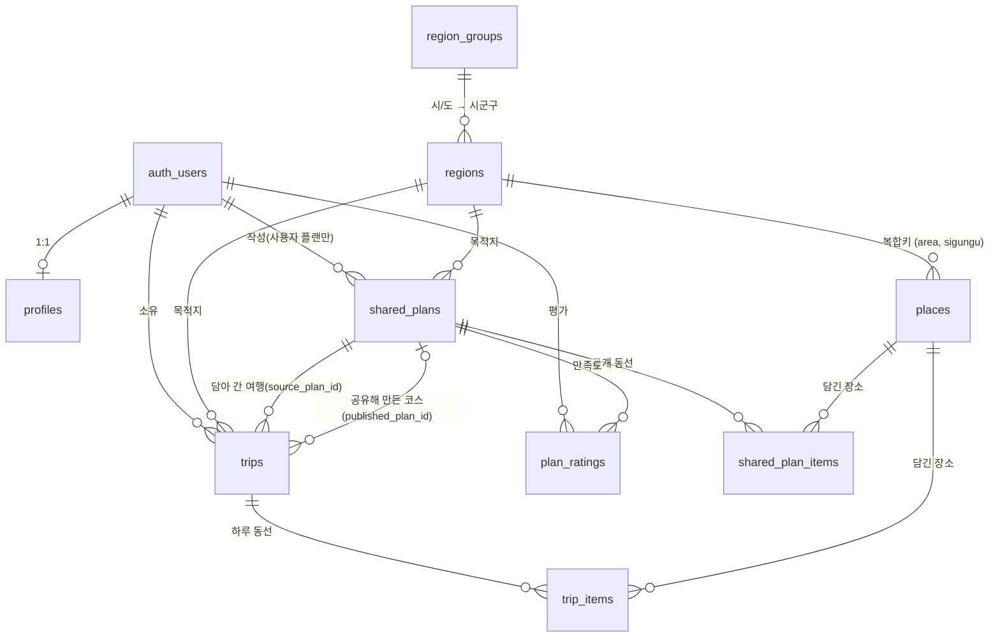

# 데이터 모델 — 테이블 · 화면 · 규칙

> **컬럼 정의는 여기 적지 않습니다.** 진실은 `schema.sql` 하나이고, 그 파일은
> `supabase/migrations/` 를 전부 적용한 결과와 같다는 것이 불변식입니다
> (`pg_dump` 비교로 확인합니다). 컬럼 목록을 문서에 베껴 두면 반드시 어긋나고,
> 그때부터 어느 쪽이 맞는지 아무도 모르게 됩니다.
>
> 이 문서는 `schema.sql` 이 담지 못하는 것만 적습니다 — **왜 있는지, 어느
> 화면이 쓰는지, 무엇을 조심해야 하는지.**
>
> 스키마를 바꿀 때는 `migrations/` 에 타임스탬프 파일을 추가하고 `schema.sql`
> 과 이 문서를 같은 커밋에서 갱신합니다.

---

## 1. 관계도

세 덩어리로 읽으면 쉽습니다.

**카탈로그** — `region_groups` → `regions` → `places`. 전부 공개 읽기이고,
TourAPI 수집 배치가 채웁니다.

**개인** — `profiles`, `trips` → `trip_items`. 전부
`auth.uid()` 소유자만 접근합니다. **관리자도 남의 것을 읽지 못합니다.**

**공유** — `shared_plans` → `shared_plan_items`, 거기 붙는 `plan_ratings`.
공개 읽기이고, 개인 덩어리와는 **복사로만** 오갑니다.

### 우리가 만들지 않은 테이블 — `auth.users`

ERD 맨 위의 `auth_users` 는 **우리 테이블이 아닙니다.** Supabase Auth(GoTrue)가
프로젝트를 만들 때 `auth` 스키마에 깔아 둔 것이고, 이후 모양이 바뀌는 것도
Supabase 가 합니다. 그래서 `supabase/migrations/` 에도 `schema.sql` 에도 없습니다 —
우리 마이그레이션은 이 테이블이 **이미 있다고 가정하고** 쓰여 있습니다. 같은
스키마에 `auth.sessions`, `auth.refresh_tokens`, `auth.identities`(소셜 연결)도
함께 있습니다.

**비밀번호는 여기 있습니다.** `auth.users.encrypted_password` 에 bcrypt 해시로
들어 있고, 우리 `public` 스키마 어디에도 비밀번호 관련 컬럼은 없습니다. PostgREST
가 `public` 만 노출하므로 브라우저에서는 유효한 세션이 있어도 그 행에 닿지
못합니다. 그래서 이 테이블은 RLS 설계 대상에서도 빠져 있습니다.

지켜야 할 선이 셋입니다.

**고치지 않습니다.** 컬럼을 더하거나 트리거를 다는 건 가능하지만 Supabase 가
자기 마이그레이션으로 덮을 수 있는 영역이고, 그러면 로그인 전체가 멈춥니다.
사용자에 딸린 정보가 필요하면 `public.profiles` 에 붙입니다.

**`id` 한 방향으로만 참조합니다.** `profiles.id uuid references auth.users on
delete cascade` 가 두 세계를 잇는 유일한 연결이고, 나머지 개인 테이블은
`profiles` 나 `auth.uid()` 를 통해 간접적으로 걸립니다. 탈퇴하면 cascade 로
프로필과 그 아래가 함께 사라집니다.

**읽지 않습니다.** 이메일이 필요하면 세션의 `user.email` 을 씁니다.

> 이 테이블이 없는 환경에서 마이그레이션을 재생하려면 스텁이 필요합니다.
> 2026-10-01 검증 때 임시 Postgres 에 `auth.users` 와 `auth.uid()` 를 직접
> 만들어 넣어야 했습니다.

---

## 2. 테이블별

### `region_groups` · `regions` — 지역 코드

**담는 것** 시/도 17개와 시군구 229개. 키는 이름이 아니라 TourAPI 코드이고,
`sigungu_code` 는 `area_code` 안에서만 유일해서 **항상 쌍으로** 다룹니다
(서울의 1과 부산의 1은 다른 구입니다).

**쓰는 화면** 목적지·지역 필터가 있는 거의 모든 화면. `useRegions` 훅이
한 번 읽어 공유합니다.

**RLS** 누구나 읽기. 쓰기는 수집 배치(service_role)만.

**주의** 각 시/도마다 `(N, -1) 미판정` 행이 있습니다. 판정에 실패한 장소를
격리하는 자리이지 실제 지역이 아니며, `db.ts` 가 `.gte('tour_sigungu_code', 0)`
으로 걸러냅니다.

### `places` — 장소 카탈로그

**담는 것** 전국 15,518곳. 대부분 TourAPI 수집(`source = 'tour'`)이고,
사람이 넣은 행은 `source = 'manual'` 에 id 가 `m-000001` 꼴입니다.

**쓰는 화면** `ExplorePage`(지도 · 이름 검색) · `PlaceDetailPage` ·
`RecommendPage` · `AdminPlacesPage`(수동 등록 목록) · `MapView` ·
`HomePage`(`home_picks()` 로 고른 5곳).

**RLS** 누구나 읽기. insert·update·delete 는 `is_admin()` 만.

**주의** `rating_avg`·`rating_count` 는 **사용자 리뷰 집계**이고 트리거가
유지합니다 — 앱이 쓰지 않습니다. 개인 리뷰(`trip_items.rating`)를 사람당 가장
최근 한 표씩 모아 평균을 냅니다. 리뷰가 여행 삭제 · 탈퇴 cascade 로 지워져도
트리거가 받으므로 어긋나지 않습니다. 리뷰가 없으면 평균은 null, 개수는 0.
장소 적재(`seed.sql`) upsert 는 이 두 칸을 건드리지 않습니다. 홈 '하루에 다녀올
만한 곳'(`home_picks()`)과 추천 장소 점수(`recommend.ts` 의 `ratingScore()`, 리뷰가 적을수록
3점 쪽으로 당긴 베이지안 평균)가 이 평균을 쓰고, 리뷰 3건 이상이면 장소 카드 · 상세 ·
지도 시트 · 추천 장소에 ★ 로 보입니다 — 자세한 흐름은
`README-플로챠트.md`.

**`content_type` 은 TourAPI 원래 타입 번호입니다.** 앱 분류는 `category` 가 정합니다 —
39 음식점은 밥집 · 카페 · 술집, 12 관광지 · 14 문화시설 · 28 레포츠 · 38 쇼핑 · 32 숙박은 모두
`spot`(명소)입니다. 그래서 명소를 조회하면 레포츠 · 쇼핑 · 숙박이 함께 나오고, 따로 거르려면
`content_type` 을 봅니다. 수동 등록 행은 null 이고, 허용 값 제약은 일부러 두지 않았습니다.

**`hidden_at` 이 있으면 숨긴 장소입니다.** TourAPI 에서 표출 중단(showflag 0)된 장소로,
수집 배치가 동기화 목록에서 골라 시드 끝의 `update` 로 채웁니다. 행을 지우지 않는 것은
`trip_items` · `shared_plan_items` 가 cascade 로 참조해서입니다 — 지우면 사용자 타임라인
항목이 함께 사라집니다. 숨긴 장소는 `places.list()` (지도 · 검색 · 추천)와 `home_picks()`
에서만 빠지고, `places.get()` · 타임라인 조인은 그대로 돌려줘 화면이 '관광정보에서 내려간
장소' 안내를 붙입니다. 표출이 재개되면 다음 시드 upsert 가 null 로 되돌립니다.

**목록은 나눠 받습니다.** API 는 한 번에 최대 1,000행(`config.toml` 의 `max_rows`)만
돌려주고 넘쳐도 오류 없이 자릅니다. '시/도 전체'가 이를 넘는 곳이 7곳(경기 3,357곳이
최대)이라 `places.list()` 는 첫 쪽에서 전체 개수를 받고 나머지 쪽을 한꺼번에 받습니다.
쪽이 흔들리지 않도록 `name, id` 로 정렬합니다.

**이름 검색은 `pg_trgm` GIN 인덱스(`places_name_trgm_idx`)를 탑니다.**
`ilike '%키워드%'` 는 앞뒤가 열려 있어 B-tree 를 못 타고, 인덱스가 없으면
15,518행을 매번 전부 훑습니다. **다만 한글은 DB 로케일에 걸려 있습니다** —
로케일이 `C` 면 한글에서 삼중자가 하나도 나오지 않아 인덱스가 걸려도 거르지
못합니다(2026-10-02 실측). 운영 DB 는 `en_US.UTF-8` 이라 제 몫을 합니다.
다른 환경에 올릴 때는 `select datcollate from pg_database where datname =
current_database();` 를 먼저 보세요.

### `profiles` — 사용자 프로필

**담는 것** 닉네임, 취향 태그, **역할**.

**쓰는 화면** `ProfileSetupPage`(온보딩) · `MyPage`. 역할은 `RequireAdmin`
가드와 모든 `is_admin()` 판정이 읽습니다.

**RLS** 자기 행만. **관리자도 남의 프로필을 못 읽습니다.** 닉네임을 밖으로
내보내는 창(`public_profiles` 뷰)이 있었지만 2026-10-01 에 없앴습니다 —
플랜 작성자는 '운영자' 아니면 '회원' 으로만 표시합니다.

**주의** `role` 은 API 로 바꿀 수 없습니다. 테이블 단위 update·insert 권한을
회수하고 `nickname`·`taste_tags` 만 다시 주었으며, 트리거가 한 겹 더 막습니다.
**관리자 임명은 SQL 로만** 합니다 — 임명 화면 자체가 가장 위험한 공격면입니다.

### `trips` · `trip_items` — 개인 하루 여행

**담는 것** 하루 동선과 방문 기록. `trip_items.note`·`rating` 은 **개인
리뷰**이고 어디에도 공개되지 않습니다.

**쓰는 화면** `TripCreatePage` → `TripRulesPage` → `TimelinePage` ·
`RoutePage` · `TripListPage` · `ExplorePage`(담기) · `PlanPublishPage`(올리기).

**RLS** 소유자만. 관리자 예외 **없음** — `trip_date` 와 방문 장소를 합치면
그 사람이 언제 어디 있었는지의 기록이 됩니다.

**주의** `source_plan_id` 는 담아 온 플랜입니다. 출처 표시에도 쓰지만 더
중요한 건 **"담은 사람만 평가" 판정**입니다 — 이 값이 없으면 담지도 않은
사람의 별점을 막을 수 없습니다. 플랜이 지워지면 null 이 되고 여행은 남습니다.

**주의** `published_plan_id` 는 반대 방향, **이 여행을 공유해 만든 코스**입니다
(Q23). 있으면 타임라인이 공유 버튼 대신 '공유 완료'를 보여 주고, 같은 여행을 두 번
공유하지 못하게 막습니다. 연결을 **비공개 쪽에 둔 것이 요점**입니다 — 코스 쪽에
여행 id 를 싣던 `source_trip_id` 는 공개 행에 개인 여행 id 가 드러나서 뺐습니다.
`trips` 는 주인만 읽으므로 이 값은 밖으로 나가지 않습니다. 코스가 지워지면 null.

### `shared_plans` · `shared_plan_items` — 공용 플랜

**담는 것** 공개된 하루 동선. `shared_plan_items` 는 **`trip_items` 와 같은
모양**이고 개인 기록만 빠집니다 — 그래야 올리기와 담기가 대칭 변환이 됩니다.

**쓰는 화면** `PlanListPage` · `PlanDetailPage` · `PlanPublishPage` ·
`MyPlansPage` · `AdminPlansPage`. 운영자 플랜도 `PlanPublishPage` 로 만듭니다 —
관리자가 올리면 `origin='admin'` 이 됩니다 (Q20).

**RLS** `is_hidden = false` 면 누구나 읽기(비로그인 포함). 쓰기는
`origin='user'` 면 작성자, `origin='admin'` 이면 관리자.

**주의** 네 가지입니다.

`origin` 하나로 운영자 플랜과 사용자 플랜을 가릅니다. 테이블을 나누면
리스트·상세·담기가 전부 두 벌이 됩니다. 운영자 플랜은
`author_user_id` 가 null 입니다.

**스냅샷입니다.** 올리는 순간 `trip_items` 를 그대로 베껴 넣고, 그 뒤로
원본 여행을 고쳐도 공개본은 바뀌지 않습니다. 원본으로 되돌아가는 링크도
없습니다 — `source_trip_id` 는 2026-10-01 에 뺐습니다. 비공개 여행의 id 를
전체 공개 테이블에 적는 셈이었고, 읽는 쪽은 "다시 올리기" 링크 하나뿐인데
그 경로가 갱신이 아니라 **중복 플랜 생성**이었기 때문입니다. 고친 동선을
올리려면 지금은 새로 올리고 옛 플랜을 내립니다.

`rating_avg` 는 평가가 없으면 **0 이 아니라 null** 입니다. 0 이면 '평가 없음'과
'최하점'이 구분되지 않습니다(지금은 지운 `places.source_rating` 에서 겪은 함정).

**`hidden_reason` 은 "누가 내렸는가"입니다.** 작성자가 스스로 내리면 null,
운영자가 내리면 `admin`, 담긴 장소가 사라져 트리거가 내리면 `place_removed`
입니다. 이 구분이 있어야 작성자 화면에서 "다시 공개" 버튼을 내보낼지
판단할 수 있습니다 — 운영자가 내린 것을 작성자가 바로 되살리면 운영자
조치가 의미를 잃습니다. 네 번째 값이던 `reported` 는 2026-10-01 에
신고 기능을 통째로 걷어내면서 없앴습니다 — 사용자가 공유하면 확인 없이
바로 뜨고, 사후 통제는 운영자 조치만 남습니다.

### `plan_ratings` — 플랜 만족도

**담는 것** 별점 1~5 와 한 줄 소감. 사람당 플랜당 1건.

**쓰는 화면** `PlanDetailPage`.

**RLS** 읽기는 누구나. 쓰기는 **그 플랜을 담은 적 있는 사람만**이고
자기 플랜은 평가할 수 없습니다. 판정은 정책이 `trips.source_plan_id` 를
들여다봐서 합니다.

**주의** 집계(`shared_plans.rating_avg`·`rating_count`)는 트리거가 유지하고,
그 트리거는 `security definer` 여야 합니다. 평가자는 남의 `shared_plans` 를
update 할 권한이 없어서, 호출자 권한으로 돌면 **RLS 에 막혀 집계가 오류 없이
조용히 갱신되지 않습니다.**

---

### `tour.*` — 수집 원본 (앱이 쓰지 않음)

**담는 것** TourAPI 에서 받은 원본과 수집 상태. 예전 수집 폴더의 `raw/` 파일을 옮겨 올
자리입니다(검토: `intent/2026-10-09-서버-수집-검토/검토.md`). 2026-10-09 지금은 테이블만
있고, 수집 · 변환은 아직 파일을 씁니다.

| 테이블 | 한 행 | 예전 파일 |
| --- | --- | --- |
| `code_tables` | 코드표 하나 | `area-codes.json` · `sigungu-N.json` |
| `list_fetches` | 받은 목록 단위(시/도 · 시군구 · 타입) | `places-*.json` 이 있다는 사실 |
| `list_items` | 장소 하나의 목록 원본 · 수정일 · 표출 중단(`hidden_at`) | `places-*.json` 항목 · `hidden.json` |
| `details` | 장소 하나의 상세 원본 · `mt` | `detail-*.json` 항목 |
| `sync_state` | 상태 값 하나 | `sync-state.json` |
| `runs` | 실행 한 번 | `logs/` · `summary.txt` |
| `place_out` | 지난번 `places` 에 반영한 결과의 지문 | (새로) |

**RLS · 권한** `tour` 는 앱 API 노출 스키마(`config.toml`)에 없고 `anon` · `authenticated`
에는 스키마 사용 권한도 없습니다. 수집 작업만 `tour_collector` 역할로 읽고 씁니다. 이
역할은 마이그레이션이 **로그인 없이** 만들고, 비밀번호는 사람이 SQL 편집기에서
`alter role tour_collector with login password '…';` 로 정합니다 — 비밀번호를 git 에
남기지 않기 위해서입니다. `places` 에 쓰는 권한은 아직 없습니다(바로 반영 단계에서 줍니다).

**주의** `details` 는 `list_items` 를 `on delete cascade` 로 참조합니다. 표출 중단된
장소는 행을 지우지 않고 `hidden_at` 만 채우므로 상세도 남습니다.

## 3. 화면 → 테이블

| 화면 | 읽고 쓰는 것 |
|---|---|
| HomePage | trips, places(`home_picks()`), regions(기준점 기본값) |
| ExplorePage (지도) | places, regions, trips, trip_items |
| PlaceDetailPage | places |
| RecommendPage (추천 장소) | places, regions, trips, trip_items — 비회원은 places·regions 만 |
| TripCreatePage → TripRulesPage | regions, trips, trip_items |
| TimelinePage | trips, trip_items |
| RoutePage | trips, trip_items |
| TripListPage | trips, trip_items |
| RecommendHubPage (추천 탭) | 아래 두 화면을 하위 탭으로 담는다 — 직접 읽는 테이블 없음 |
| PlanListPage (추천 코스) | shared_plans, regions |
| PlanDetailPage | shared_plans, shared_plan_items, places, plan_ratings |
| PlanPublishPage | trips, trip_items → shared_plans, shared_plan_items |
| MyPlansPage | shared_plans |
| MyPage | profiles |
| ProfileSetupPage | profiles |
| AdminPlansPage | shared_plans |
| AdminPlacesPage | places, regions |

---

## 4. 가로지르는 규칙

**지역은 코드 쌍으로.** 이름을 키로 쓰면 '강서구'가 서울·부산에 둘 다 있어
접두어를 붙여야 하고, 행정구역 개칭이 FK 연쇄가 됩니다. 코드가 키면 이름은
update 한 번으로 바꾸는 단순 속성입니다. 복합 FK 는 `MATCH SIMPLE` 이라
`tour_sigungu_code` 가 null 이면 검사를 건너뜁니다 — 그래서 "시/도 전체"는
통과하고 구를 지정한 경우에만 검증됩니다.

**미판정은 버리지도 욱여넣지도 않습니다.** 판정에 실패한 장소는 `-1` 로
격리해 수동 처리 대기열로 둡니다. 화면에서는 `db.ts` 가 거릅니다.

**공유는 복사입니다.** 올리기도 담기도 참조가 아니라 스냅샷 복사입니다.
원본이 바뀌거나 사라져도 상대쪽은 그대로입니다. 그 대가로 "원본이 수정됨 ·
다시 올리기" 배너가 필요합니다.

**수동 장소 id 는 `m-` 접두사.** TourAPI contentid 는 전부 숫자라 겹칠 수
없습니다. 다만 실제 안전장치는 접두사 규약이 아니라 수집 배치의
`on conflict ... where places.source = 'tour'` 입니다. 관리자 직접 등록과
요청 승인은 **같은 시퀀스**(`manual_place_seq`)를 씁니다 — 둘 중 하나를
지울 일이 생겨도 시퀀스는 남겨야 합니다.

**`security definer` 를 쓴 자리와 이유.**

| 함수 | 왜 |
|---|---|
| `is_admin()` | 정책 안에서 `profiles` 를 읽으면 그 테이블의 RLS 가 또 평가돼 무한 재귀 |
| `clone_shared_plan()` | RLS 아래에서 남의 `clone_count` 를 올릴 수 없음 |
| `admin_create_place()` | 같은 시퀀스로 id 를 매겨야 함 |
| `plan_ratings_refresh()` | 평가자가 남의 `shared_plans` 를 update 할 수 없음 |
| `shared_plan_items_hide_parent()` | 같은 이유 |
| `place_rating_recompute()` · `trip_items_rating_refresh()` · `trips_rating_refresh()` | 리뷰 쓴 사람의 권한이면 RLS 때문에 **자기 리뷰만으로** 평균을 냄(오류 없이 틀린 값), 게다가 `places` 쓰기는 관리자만 |
| `profiles_guard_role()` | **반대로 definer 면 안 됨** — 정의자 권한 안에서는 `current_user` 가 호출자가 아니라 함수 소유자가 되어 판정이 항상 통과 |

**장소가 사라지면 플랜을 내립니다.** `shared_plan_items` 는 `on delete
cascade` 로 `places` 를 참조하는데, 항목만 조용히 지우면 3곳짜리 플랜이
2곳이 된 채 공개돼 있고 아무도 모릅니다. 반대로 FK 를 `restrict` 로 걸면
재수집 배치가 통째로 실패합니다. 그래서 cascade 를 두고, 트리거가 부모
플랜을 `hidden_reason = 'place_removed'` 로 내립니다.

**DB 를 나누지 않습니다.** "여행과 플랜을 다른 DB 로" 라는 생각이 나올
자리인데, 나누면 평가 자격 검사(`plan_ratings` 정책이 `trips` 를 봅니다),
집계 트리거, 담기 트랜잭션, 장소 삭제 시 자동 숨김이 전부 불가능합니다.
정작 필요한 분리는 DB 가 아니라 **권한과 컬럼**이고, 그건 이미 되어
있습니다.

---

## 5. RLS 가 실제로 막는 것

마이그레이션 전체를 적용한 DB 에서 네 역할(작성자·담은이·제3자·관리자)로
확인한 목록입니다. 정책을 고칠 때 이 목록이 깨지지 않는지 보세요.

- 남의 여행·타임라인 항목·프로필 조회 — **관리자도 막힘**
- 비로그인의 프로필 조회
- 남의 여행에 항목 끼워 넣기
- 자기 `role` 을 `admin` 으로 바꾸기, 가입 시 `role` 지정
- 남의 플랜 수정·삭제·항목 추가, `clone_count` 직접 조작
- 운영자 플랜을 자기 것으로 가로채기
- 담지 않은 사람의 평가, `user_id` 를 속인 평가, 작성자의 자기 플랜 평가
- 남의 평가 수정·삭제
- `status='approved'` 로 요청 위조, 남의 요청 조회, 요청 자가 승인
- 비관리자의 `admin_create_place()` 직접 호출

반대로 **열려 있어야 하는 것**: 비로그인의 지역·장소·공개 플랜·만족도 조회.
공유 링크를 받은 사람이 로그인 벽을 먼저 만나면 공유가 성립하지 않습니다.
