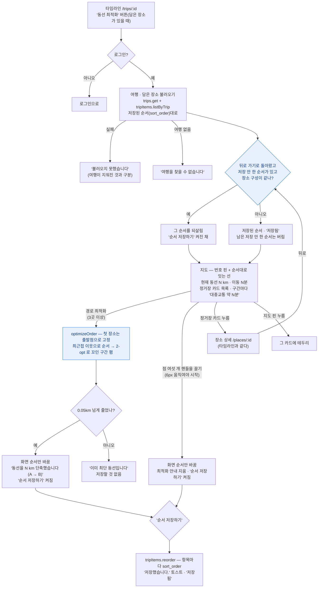

# 내 여행 — 동선 최적화

> 다른 화면: [홈](홈.md) · [지도](지도.md) · [추천](추천.md) · [새 여행 만들기](여행-만들기.md) · [장소 업데이트](장소-업데이트.md) · [목록](../README-플로챠트.md)
>
> 여행 타임라인의 '동선 최적화'(`/trips/:tripId/route`)에서 담은 장소의 방문 순서를 지도와 목록으로
> 보고, **경로 최적화**(최단 거리)나 **끌어서** 순서를 바꾼 뒤 **'순서 저장하기'** 로 반영하는 화면입니다.
> 타임라인과 달리 바꾼 순서는 저장을 눌러야 DB 에 들어갑니다 — 최적화 결과를 보고 되돌릴 수 있게.
> 화면은 `src/pages/RoutePage.tsx`(TRIP-03-02), 최적화 · 거리 · 시간은 `src/lib/geo.ts` 의
> `optimizeOrder()` · `routeDistanceKm()` · `routeMinutes()`, 저장은 `tripItems.reorder()`(`src/lib/db.ts`).

## 흐름

## 규칙 한눈에

| # | 규칙 | 값 |
|---|---|---|
| 1 | 들어오는 곳 | 타임라인 아래 '총 N km · 이동 N분 · N곳' 카드의 **동선 최적화** 버튼(담은 장소가 1곳 이상일 때). 로그인 필요(`RequireAuth`) |
| 2 | 처음 순서 | 저장된 순서(`sort_order`) — 타임라인과 같은 순서 |
| 3 | 거리 · 시간 | 거리는 정거장 사이 직선(대권) 거리의 합. 시간은 구간마다 직선 × 1.3(우회) ÷ 이동수단 평균 속도 — 도보 4 · 대중교통 18 · 자가용 30km/h, 구간 최소 1분. 이동수단은 여행 규칙에서 고른 것 |
| 4 | 경로 최적화 | 3곳 이상일 때만(2곳 이하는 버튼이 꺼지고 '3곳 이상일 때 효과가 있습니다'). 첫 장소를 출발점으로 고정하고 최근접 이웃 → 2-opt(최대 50바퀴). 돌아오는 길은 세지 않는 열린 경로 |
| 5 | 최적화 결과 | 0.05km 넘게 줄면 '동선을 N km 단축했습니다 (A km → B km)' + 저장 버튼 켜짐. 아니면 '이미 최단 동선입니다' — 순서는 바뀌어도 저장 버튼은 그대로 |
| 6 | 끌어서 바꾸기 | 카드 오른쪽 점 여섯 개 **핸들만** 끌린다(카드 본문은 누르는 버튼). 6px 움직여야 끌기 시작 · 핸들은 `touch-none` — 폰 세로 스크롤과 안 부딪히게. 키보드(스페이스 · 화살표)도 됨 |
| 7 | 저장 | 바꾼 순서는 화면에만 있다가 **'순서 저장하기'** 를 눌러야 반영(`tripItems.reorder()`). 저장하면 '저장했습니다.' 토스트, 버튼은 '저장됨' |
| 8 | 카드 누름 | 장소 상세(`/places/:id`)로 — 타임라인 카드와 같다(10/10, 예전엔 지도 핀만 골랐다) |
| 9 | 핀 누름 | 그 정거장 카드에 테두리 |
| 10 | 저장 안 하고 상세 다녀옴 | 뒤로 가기로 돌아오면 바꾼 순서 · 최적화 안내 · '순서 저장하기'를 되살린다(장소 구성이 같을 때만). 타임라인에서 새로 들어오면 버리고 저장된 순서로 — 저장 안 하고 나간 것이므로. 앱을 켜 둔 동안만 기억(10/10) |
| 11 | 스크롤 | 상세에 다녀오면 떠날 때 자리로(`ScrollMemory`, 앱 전체 공통) |

## 구현 메모

| 무엇 | 어디 |
|---|---|
| 화면 | `RoutePage.tsx` — `items`(화면 순서) · `dirty`(저장 안 한 순서 있음) · `saved`(최적화 전후 km) · `selectedId`(핀으로 고른 곳) |
| 저장 안 한 순서 기억 | 모듈 변수 `unsavedOrder = { tripId, itemIds, saved }` — `dirty` 일 때마다 갱신, 저장하면 지움. 되살리기는 `useNavigationType() === 'POP'` 이고 항목 id 집합이 같을 때만 |
| 최적화 | `optimizeOrder(points)` → 순서 인덱스. 새 여행 자동 담기(`TripRulesPage`)도 같은 함수로 처음 순서를 정한다 |
| 지도 | `MapView` 에 `route` 를 넘기면 번호 핀 + 선(Polyline). 네이버 지도가 없으면 SVG 폴백 |
| 끌기 | `@dnd-kit` — 타임라인과 같은 센서 설정(Pointer 6px · Keyboard) |

알려진 한계:

- 저장 실패를 화면에 알리지 않는다 — `save()` 에 오류 처리가 없어 버튼만 다시 켜진다.
- 저장은 항목마다 한 번씩 update 를 보낸다(`Promise.all`) — 중간에 일부만 실패하면 순서가 섞일 수 있다.
- 출발점이 첫 장소로 고정이라, 첫 장소를 바꾸고 싶으면 먼저 끌어서 맨 위에 둔 뒤 최적화한다.
