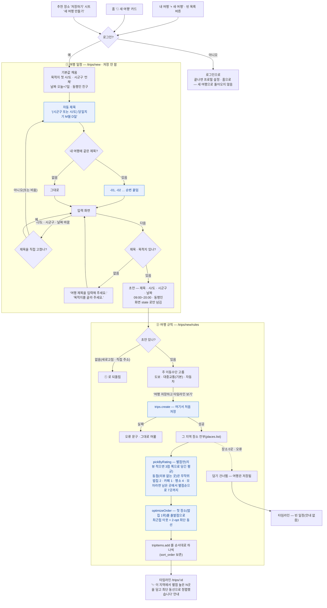

# 내 여행 — 새 여행 만들기

> 다른 화면: [홈](홈.md) · [지도](지도.md) · [추천](추천.md) · [동선 최적화](동선-최적화.md) · [장소 업데이트](장소-업데이트.md) · [목록](../README-플로챠트.md)
>
> '내 여행'에서 새 여행을 만드는 두 단계입니다. **① 여행 일정**(목적지 · 제목 · 날짜 · 동행인)은
> 저장하지 않고 초안만 넘기고, **② 여행 규칙**(주 이동수단)에서 한 번에 저장한 뒤 추천 장소
> 7곳을 자동으로 담아 타임라인으로 갑니다.
> 화면은 `src/pages/TripCreatePage.tsx`(TRIP-02-01) · `src/pages/TripRulesPage.tsx`(TRIP-02-02),
> 저장은 `trips.create()` · `tripItems.add()`(`src/lib/db.ts`), 고르기는 `pickByRating()`(`src/lib/recommend.ts`),
> 순서는 `optimizeOrder()`(`src/lib/geo.ts`).

## 흐름

## 규칙 한눈에

| # | 규칙 | 값 |
|---|---|---|
| 1 | 들어오는 곳 | 내 여행 머리의 '+ 새 여행' · 여행이 없을 때 빈 목록 버튼 · 홈의 '🧳 새 여행' 카드(다가오는 여행이 없을 때) · 추천 장소 '저장하기' 시트의 '새 여행 만들기'. 모두 `/trips/new` |
| 2 | 로그인 | `/trips/*` 는 모두 로그인 필요(`RequireAuth`). 비회원은 로그인으로 가고, 끝나면 `/onboarding` → (프로필이 있으면) 홈으로 간다 — 새 여행 화면으로 돌아오지 않는다(아래 구현 메모) |
| 3 | 목적지 | 시/도 + 시군구('전체' = 시군구 없음). 처음엔 첫 시/도 · '전체'. 시/도를 바꾸면 시군구는 '전체'로 되돌림 |
| 4 | 자동 제목 | `(시군구 이름 또는 시/도 이름) 당일치기 M월 D일`. 내 기존 여행에 같은 제목이 있으면 `-01`, `-02` … 순번. 목적지 · 날짜를 바꾸면 다시 계산 |
| 5 | 직접 쓴 제목 | 직접 고치면 목적지 · 날짜를 바꿔도 건드리지 않는다. 칸을 비우면 다시 자동 제목. 최대 30자 |
| 6 | 날짜 · 시간 | 날짜는 오늘 + 7일이 기본. 시간은 화면에 없고 09:00~20:00 고정(나중에 타임라인에서 바꿈) |
| 7 | 동행인 | 칩 여러 개 선택. 기본 '친구' |
| 8 | ①은 저장 안 함 | '다음'에서 제목 · 목적지만 검사하고, 초안은 화면 이동 state 로만 넘긴다 — 중간에 그만두면 DB에 빈 여행이 남지 않는다. 대신 ②에서 새로고침하면 초안이 사라져 ①로 돌아간다 |
| 9 | 이동수단 | 도보 · 대중교통 · 자동차, 기본 대중교통. 평균 속도(`TRANSPORT_SPEED_KMH`)로 장소 간 이동 시간을 계산한다 |
| 10 | 저장 | '여행 저장하고 타임라인 보기'에서 `trips.create()` 한 번. 실패하면 오류 문구를 띄우고 그 화면에 머문다 |
| 11 | 자동 담기 | 저장 직후 **7곳 — 밥집 2 · 카페 1 · 명소 4**(명소 2 → 4, 10/10). 종류마다 **별점만** 보고 높은 순 — 리뷰가 적을수록 3점 쪽으로 당긴 평균(추천 탭과 같은 베이지안 평균), 리뷰 없는 곳끼리(지금은 대부분)는 무작위. 한 종류가 모자라면 남은 장소에서 같은 순서로 7곳까지 채운다. **시간대 · 날씨 · 취향 태그는 쓰지 않는다**(10/10 — 종류마다 따로 뽑으면 시간대 · 날씨 가산이 그 종류 전부에 같아 순서를 못 바꿨고, 시각도 여행 날짜가 아니라 저장 순간이었다. 날씨 조회도 없앰) |
| 12 | 순서 | 별점 순위가 아니라 최단 동선 — 첫 장소(밥집 1위)를 출발점으로 고정하고 최근접 이웃 + 2-opt. 하나씩 차례로 담아 순서(sort_order)가 그대로 남는다 |
| 13 | 담기 실패 | 장소가 없거나 오류면 담기만 건너뛴다 — 여행은 이미 저장됐으니 빈 타임라인으로 간다(안내 없음) |
| 14 | 타임라인 안내 | 담은 곳이 있으면 '✨ 이 지역에서 별점 높은 N곳을 담고 최단 동선으로 정렬했습니다. 마음에 들지 않으면 빼고 직접 담아 보세요.' — 닫기 가능. 뒤로 가기로 ②에 돌아오지 않게 `replace` 로 이동 |
| 15 | 수정 모드 | `/trips/:id/rules` 는 같은 화면으로 이동수단만 바꿔 저장(`trips.update`) — 자동 담기 없음, 버튼은 '규칙 저장하고 타임라인 보기' |

## 구현 메모

- **두 단계 · 한 번 저장**: ①이 `navigate('/trips/new/rules', { state: draft })` 로 초안을 넘기고, ②가
  `trips.create({ user_id, ...draft, transport })` 한다. 초안은 URL 이 아니라 state 로만 다닌다(개인
  정보 · 위치를 URL 에 넣지 않는 규칙과도 맞음).
- **로그인 뒤 돌아오기 없음 — 남은 빈틈**: `RequireAuth` 가 `state.from`(원래 주소)을 넘기지만
  `LoginPage` 는 읽지 않고 항상 `/onboarding` 으로 보낸다(프로필이 있으면 홈). 지도 · 코스 상세도 같은
  `from` 을 넘기므로, 고치면 한 곳(`LoginPage` · 구글은 `AuthCallbackPage`)에서 함께 고쳐진다.
- **제목 중복 확인**은 ① 화면을 열 때 `trips.list(user.id)` 로 내 여행 제목을 미리 받아 둔다. 서버
  제약은 없어서, 다른 기기에서 같은 제목을 동시에 만들면 겹칠 수 있다(영향 작음).
- **자동 담기는 브라우저에서 고른다**: `places.list()` 로 그 지역 장소를 전부 받는다(경기 '전체'면
  3천 곳 넘게). 별점 순 상위 몇 곳만 필요하니 DB 함수로 옮기면 가볍다 — 남은 빈틈.
- **다른 길 — 추천 코스 복사**: 코스 상세의 '내 여행으로'는 이 두 단계를 거치지 않고
  `sharedPlans.clone()`(DB 함수 `clone_shared_plan`)으로 코스의 목적지 · 시간 · 동행인 · 이동수단 ·
  장소를 그대로 복사해 바로 만든다. 자동 담기는 없다.
