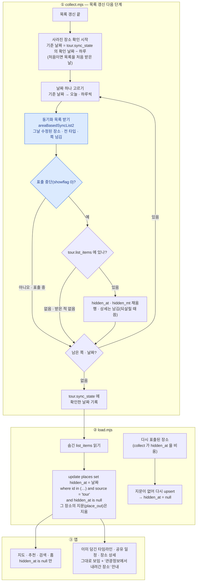

# 여행정보 · 장소 업데이트 흐름

> 다른 화면: [홈](홈.md) · [지도](지도.md) · [추천](추천.md) · [새 여행 만들기](여행-만들기.md) · [동선 최적화](동선-최적화.md) · [목록](../README-플로챠트.md)
>
> 홈 · 지도 · 추천이 읽는 장소(`places`)가 TourAPI 에서 운영 DB 까지 오는 길입니다.
> 실제 코드(`collect.mjs` · `load.mjs` · `run-daily.sh`) 그대로입니다. **파일을 거치지 않습니다** —
> 원본 · 상태 · 실행 기록 · 연동 로그는 DB 의 `tour` 스키마, 앱이 보는 장소는 `places`.
> 실행 방법은 [수집 폴더 README](../intent/2026-09-20-재수집-스키마-교체/README.md), 구조를 정한
> 이유는 [서버 수집 검토](../intent/2026-10-09-서버-수집-검토/검토.md) 에 있습니다.

```mermaid
flowchart TD
    subgraph C["① 수집 — collect.mjs · 매일 0시 5분 GitHub Actions(옮기기 전엔 Mac launchd 0시) · tour_collector 로 접속"]
        C0["0시 자동 실행<br/>키 · DB: Actions Secrets(Mac 은 .key · .db-url)<br/>tour.runs 에 시작 기록<br/>화면 출력은 줄마다 tour.run_logs 로"] --> S1["목록 갱신 — 목록 수정일(modifiedtime) 기준<br/>기준 시각 = tour.sync_state − 하루"]:::key
        S1 --> T1["타입 하나 고르기<br/>39 · 12 · 14 · 28 · 38 · 32 · 15 · 25 (8개)"]
        T1 --> T2["전국 목록 한 쪽 받기<br/>areaBasedList2 · 지역 조건 없음<br/>수정일 순(arrange Q) · 100곳"]:::key
        T2 --> T3{"앞 장소보다 수정일이<br/>최신인 장소가 있나?"}
        T3 -- "있음 · 정렬을 믿을 수 없음" --> S3["갱신 적용 안 함<br/>상세 수집은 계속"]
        T3 -- "없음" --> T4{"기준 시각보다 오래된<br/>장소에 닿았나?"}
        T4 -- "아니오 · 다음 쪽 있음" --> T2
        T4 -- "예 · 또는 마지막 쪽" --> T5{"남은 타입이 있나?"}
        T5 -- "있음" --> T1
        T5 -- "없음 · 8타입 끝" --> S4["바뀐 장소를 tour.list_items 에 반영<br/>수정 · 새로 · 시군구 이동<br/>시군구 = areacode → 없으면 법정동 코드<br/>하나도 못 이으면 기준 시각을 앞당기지 않음"]
        S3 --> H1
        S4 --> H1["사라진 장소 — 동기화 목록 날짜별<br/>표출 중단 → list_items.hidden_at<br/>(아래 '사라진 장소 정리')"]
        H1 --> C1["코드표 tour.code_tables<br/>있으면 건너뜀"]
        C1 --> C2{"목록 단위 받음?<br/>tour.list_fetches (시도 · 시군구 · 타입)"}
        C2 -- "없음" --> C3["목록 받기 areaBasedList2<br/>묶음 1(39·12·14) → 2(28·38·32) → 3(15·25)<br/>묶음마다 목록 → 상세"]
        C2 -- "있음" --> C4["건너뜀<br/>바뀐 것은 목록 갱신이 이미 반영"]
        C3 --> C5
        C4 --> C5{"장소마다 상세가 필요?<br/>목록 수정일 vs tour.details.mt"}:::key
        C5 -- "새 장소 · 수정일이 mt 와 다름" --> C6["상세 받기<br/>detailCommon2 + detailIntro2<br/>장소당 2호출 · 한 곳마다 tour.details 에 저장"]
        C5 -- "이미 받음 · 숨긴 장소" --> C7["건너뜀"]
        C6 --> C8{"일일 한도?<br/>약 2,000호출"}
        C8 -- "남음" --> C5
        C8 -- "초과" --> C9["■ 하루 한도 도달 · 정상 종료(0)<br/>다음 날 그 자리에서 이어받음<br/>진짜 오류만 종료코드 1"]
        C7 --> C10
        C9 --> C10["tour.runs 에 결과 · 호출 수 · 오류"]
    end

    subgraph L["② 반영 — load.mjs · 수집 바로 뒤 (한도로 멈춘 날도)"]
        L1["tour.* 읽기<br/>목록 순서 = 수정일 내림차순 → contentid"] --> L2{"좌표가 믿을 만한가?<br/>한국 범위 · COORD_SUSPECT"}
        L2 -- "아니오" --> L9["미판정(-1)으로 격리<br/>사유를 region_note 에"]
        L2 -- "예" --> L3["지역 판정<br/>1 응답의 시군구코드 → 2 주소의 시군구명"]
        L3 -- "못 찾음" --> L9
        L3 --> L4["사람 교정 덮어쓰기<br/>PLACE_REGION_FIX → region_source = manual"]
        L4 --> L5["내용 정리 · 원래 타입은 content_type 에<br/>분류: 39 → 밥집·카페·술집 · 12·14·28·38·32 → 명소<br/>15·25 → 넣지 않음(tour.* 에만)<br/>소개 첫 문장 · 영업시간 · 전화 · 태그"]
        L9 --> L5
        L5 --> L6["지문(hash) 비교<br/>tour.place_out 과 다른 장소만"]:::key
        L6 --> L7{"안전 검사<br/>반영할 장소 ≥ 지금 places 의 90%?"}
        L7 -- "아니오" --> L8["반영 안 함 · tour.runs 에 실패"]
        L7 -- "예" --> D4["한 트랜잭션<br/>지역 · 시/도 통째 · 바뀐 장소만 upsert<br/>숨김은 hidden_at · 지문 갱신"]
        D4 --> D5["TourAPI 행(source = tour)만 갱신<br/>이름 · 주소 · 좌표 · 사진 · 소개 · 영업시간 · 전화 · 태그"]
        D4 --> D6["그대로 두는 것<br/>수동 등록(m-) 행 · manual 로 고친 지역<br/>별점 평균 · 리뷰 · 여행 · 코스"]
        D4 --> D7["tour.runs 에 바뀐 수 · 주소 대조 결과<br/>화면 출력은 tour.run_logs"]
    end

    C10 --> L1
    M["--demo 를 붙이면 데모 모드 데이터<br/>src/lib/seed.ts 도 다시 만든다(앱 코드)"] -.-> L5

    classDef key fill:#e8f0fe,stroke:#1a73e8,color:#0b3d91
```

**업데이트 판단은 목록 수정일 하나로 합니다**(파란 칸). TourAPI 는 장소마다 수정일을
하나만 주고, 그 값이 목록과 상세 공통에 함께 실립니다.

| 응답 | 수정일 | 업데이트 판단에 쓰나 |
|---|---|---|
| 목록 `areaBasedList2` | 있음 — 장소 수정일 | **씀** — 바뀐 장소를 고르고(목록 갱신), 상세를 다시 받을지 정함 |
| 상세 공통 `detailCommon2` | 있음 — 목록과 같은 값 | 안 씀 — 소개 글 · 전화 때문에 받음 |
| 상세 소개 `detailIntro2` | 없음 | — (영업시간 · 주차 · 메뉴) |

`mt` 는 TourAPI 값이 아니라 **상세를 받던 순간의 목록 수정일을 적어 둔 메모**입니다. 목록
수정일이 `mt` 와 다르면 "상세를 받은 뒤에 장소가 고쳐졌다"고 보고 상세를 다시 받습니다.
상세 소개(영업시간 등)만 따로 고쳐졌는지 알 방법은 없어, 장소 수정일이 그것까지
포함한다고 봅니다.

**받는 타입과 앱 분류** — TourAPI 콘텐츠 타입 8개를 모두 받고, 원래 타입
번호는 `places.content_type` 에 남깁니다. '기타'는 개념상 묶음이라 화면에 따로 표시하지 않습니다.

| 타입 | 수집 묶음 | 앱 |
|---|---|---|
| 39 음식점 | 1 | 밥집 · 카페 · 술집 |
| 12 관광지 · 14 문화시설 | 1 | 명소 |
| 28 레포츠 · 38 쇼핑 · 32 숙박 (기타) | 2 | 명소 — 지도 · 추천 · 홈의 명소에 함께 |
| 15 축제공연행사 · 25 여행코스 | 3 | 데이터만(`tour.*`) — places 에 넣지 않음 |

새 타입도 업데이트는 같은 방식입니다 — 처음엔 받은 목록 단위가 없어 시군구 목록과 상세를 받고,
그 뒤로는 매일 목록 갱신이 8개 타입을 모두 봅니다. 화면에 보일 타입을 바꾸려면
`load.mjs` 의 `CONTENT_TYPES` 표 한 줄만 고칩니다.

수집과 반영은 한 번에 이어서 돕니다 — 사람이 손댈 단계가 없습니다.

| 단계 | 언제 | 무엇이 남나 |
|---|---|---|
| ① 수집 | 매일 0시 자동. 먼저 목록 갱신(타입 8개 · 타입당 몇 호출) · 사라진 장소(2~3호출), 그다음 타입 묶음 1 → 2 → 3 순서로 목록 · 상세를 한도(약 2,000호출 = 장소 1,000곳)까지 받고 멈춤 | `tour.*` 원본 · `tour.sync_state` · `tour.runs` · 연동 로그 `tour.run_logs`(30일) |
| ② 반영 | 수집 바로 뒤 자동 | 운영 DB `places`(바뀐 것만) · `regions` · `region_groups` · `tour.place_out` 지문 |

반영은 있는 행을 고쳐 쓰는 upsert 라 운영 DB 의 사용자 데이터(별점 평균 · 리뷰 · 여행 ·
코스)는 그대로 남습니다. 사람이 손댄 것 — 관리자가 등록한 장소(`m-` 접두사)와 지역을
`manual` 로 고친 장소 — 도 덮지 않습니다. 수집 작업의 DB 역할(`tour_collector`)에는 그렇게
묶인 권한만 있습니다 — 지우는 권한도 없습니다.

## 남은 빈틈

- **완전히 지워진 장소는 모릅니다.** 표출 중단은 동기화 목록으로 잡지만(아래), 동기화 목록에도
  안 나오고 사라진 장소는 알 방법이 없습니다 — 드물다고 보고 둡니다.
- **상세 소개만 바뀐 것은 모릅니다.** `detailIntro2`(영업시간 등)에는 수정일이 없어, 장소 수정일이
  그것까지 포함한다고 봅니다.
- **시군구를 못 정한 새 장소는 건너뜁니다.** 목록 갱신 응답에 시군구 코드가 비어 있으면 법정동
  코드로 찾고, 그래도 없으면 연동 로그에 `?` 줄로 코드를 남깁니다.
- **매일 실행 — GitHub Actions 로 옮기는 중(10/10).** 워크플로 `.github/workflows/collect.yml` 이 매일 0시 5분에
  수집 → 반영을 돕니다(맥이 꺼져 있어도). Secrets 를 넣고 수동 실행으로 확인한 뒤 Mac 예약(launchd)을
  끕니다 — 둘을 함께 켜 두면 같은 키의 하루 한도를 나눠 먹습니다. 순서는
  [수집 README](../intent/2026-09-20-재수집-스키마-교체/README.md) '서버로 옮기기'.
- **일일 한도(약 2,000호출)로 상세가 하루 1,000곳씩만 찹니다.** 운영계정 전환으로 늘릴 수 있습니다.

## 사라진 장소 정리

TourAPI 는 장소를 지우지 않고 **표출 중단(showflag 0)** 으로 돌립니다. 그런 장소는 일반
목록(`areaBasedList2`)에 더는 나오지 않아 우리 목록 갱신으로는 알 수 없고, **동기화 목록
(`areaBasedSyncList2`)** 에만 표출 여부와 함께 나옵니다. 그래서 목록 갱신 바로 뒤에 날짜별로
동기화 목록을 받아 표출 중단된 장소를 골라냅니다. 지우지 않고 **숨깁니다** — 지우면 그
장소가 담긴 사용자 타임라인 항목이 cascade 로 사라집니다.

| 항목 | 내용 |
| --- | --- |
| DB | `20261010000000_place_hidden_at` — `places.hidden_at timestamptz`(null = 보임) · `home_picks()` 에 조건 한 줄. 관리자 등록(`m-`) 행은 건드리지 않음 |
| 안전장치 | 응답 수정일이 물은 날짜가 아니거나 showflag 칸이 없으면 아무것도 바꾸지 않음. 실패해도 상세 수집은 계속 |
| 미리보기 | `node collect.mjs --sync-dry` — 목록 갱신과 함께 숨길 · 되살릴 장소를 보여 줌 |
| 호출 수 | 하루 2~3회(어제 · 오늘 · 쪽 넘김). 며칠 쉬었으면 그 날짜 수만큼 |
| 되살림 | 표출이 재개되면 수정일이 바뀌어 목록 갱신에 다시 잡히고, upsert 가 `hidden_at` 을 비움 |
| 확인할 것 | `areaBasedSyncList2` 의 날짜 인자 형식 · 쪽 크기 — 실제 API 로 돈 첫 실행의 연동 로그(`node collect.mjs --log`)로 확인 |
