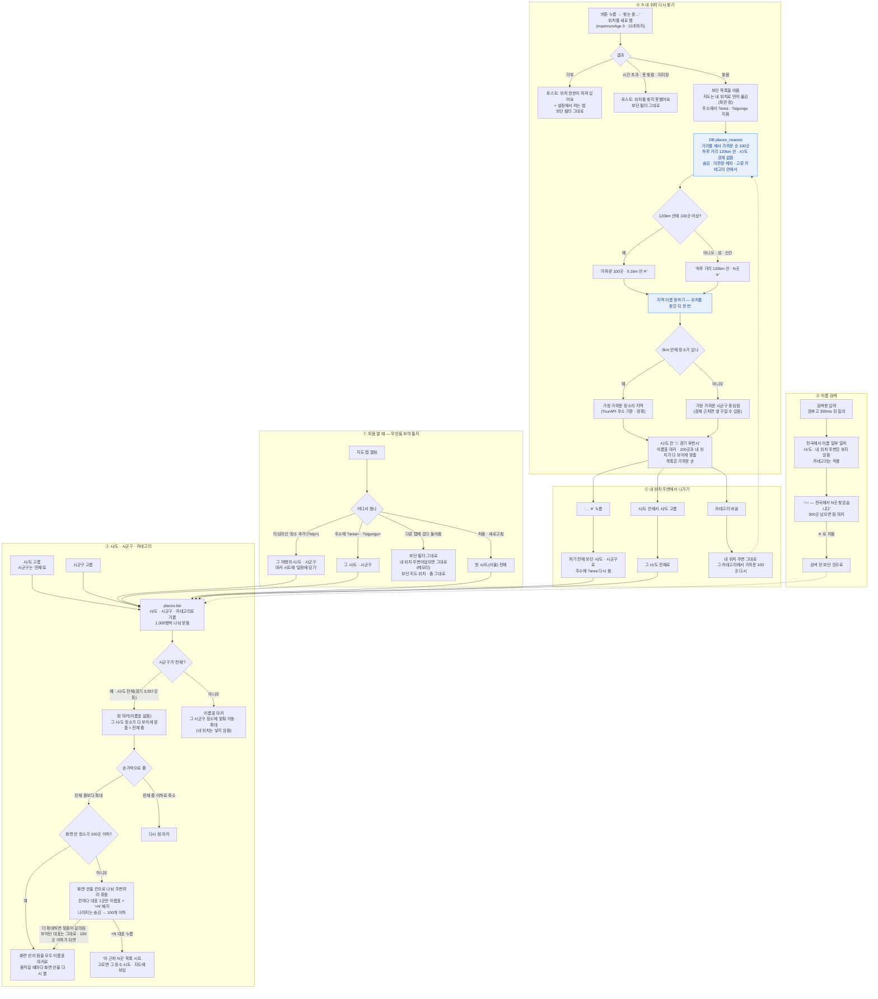

# 지도 탭 — 장소 찾기 흐름

> 다른 화면: [홈](홈.md) · [추천](추천.md) · [장소 업데이트](장소-업데이트.md) · [목록](../README-플로챠트.md)
>
> 지도 탭(`/map`)에서 장소를 찾는 세 가지 길 — **시/도 · 시군구 고르기**, **이름 검색**,
> **'↻ 내 위치 다시 찾기'** — 과 그 사이를 오가는 규칙입니다.
> 화면은 `src/pages/ExplorePage.tsx`, 조회는 `places.list()` · `places.nearest()`(`src/lib/db.ts`),
> 내 위치 주변의 DB 함수는 `supabase/migrations/20261014000000_places_nearest.sql`.

## 규칙 한눈에

| # | 규칙 | 값 |
|---|---|---|
| 1 | 처음 보여 줄 곳 | 여행에서 왔으면 그 여행 지역 → 주소의 `?area` → 다른 탭에서 돌아왔으면 보던 그대로 → 아니면 첫 시/도(서울) 전체 |
| 2 | 시/도 · 시군구 | `places.list()` — API 상한(1,000행) 때문에 나눠 받음. 시/도 전체는 점 마커, 시군구는 이름표 마커. 고르면 그 지역 장소에만 맞춰 이동 · 확대(강동구를 고르면 강동구로) — 내 위치는 넣지 않는다. 예전에는 부천에서 위치를 찾은 뒤 강동구를 고르면 부천까지 넣느라 확대되지 않았다 |
| 2-1 | 점 ↔ 이름표 | 점 마커(시/도 전체 · 300곳 넘는 검색 결과)는 자동으로 맞춘 줌이 '전체 줌'. 그보다 확대하면 **화면 안의 장소만** 이름표 마커로, 전체 줌 이하로 줄이면 다시 점. 화면 안이 **100곳(`TAG_MAX`)을 넘으면** 주변끼리 칸으로 묶고 칸마다 대표 1곳만 이름표로 그린다 — 대표에는 묶인 다른 곳 수를 '+N' 배지로, 나머지는 숨김. 대표는 리뷰 많은 곳 → 평균 높은 곳. 칸은 화면이 아니라 **지도에 고정된 격자**(위도 8도 칸에서 단계마다 정확히 넷으로 나눔)이고, 대표가 100개 이하가 되는 가장 잘은 단계를 이분 탐색으로 고른다(`groupRepresentatives()`, `src/lib/map-group.ts`). 그래서 확대하면 묶음이 갈라지기만 하고, 보이던 대표는 화면 안에 있는 한 계속 보인다 — 예전에는 화면 범위로 칸을 다시 그어, 확대하면 '용산역광장 +3' 같은 대표가 다른 칸 대표에 밀려 숨었다(10/9 고침). 단계가 넷씩 나뉘어 대표는 보통 70~100개. 처음엔 1,000곳이었는데 화면에 이름표가 너무 많아 100으로 줄였다(10/9). 고른 장소는 숨기지 않는다. 지도를 움직일 때마다(idle) 화면 안을 다시 보고 바뀌는 마커만 다시 그린다. 다른 탭에 갔다 오면 보던 줌 · 전체 줌을 함께 복원. 네이버 지도만(SVG 폴백 지도는 줌이 없음) |
| 3 | 이름 검색 | 멈추고 300ms 뒤. 전국 · 이름 일부 일치. 시/도 필터와 내 위치 주변보다 우선. 300곳 넘으면 점 |
| 4 | 내 위치 재기 | 홈과 같은 `locate()` — 새로 잼(`maximumAge 0`), 10초까지. 실패하면 토스트만 내고 보던 것 그대로 |
| 5 | 내 위치 주변 | DB 함수 `places_nearest(위도, 경도, 100, 120, 카테고리)` — 가까운 순 **100곳**, 하루 거리 **120km** 안, 시/도 경계 없음. 한 번 묻는다 |
| 6 | 왜 100곳 | 120km 안을 통째로 보이면 수도권은 7,000곳 가까이(부천 6,821곳) 돼 지도가 점으로 뒤덮였다. 100곳이 차는 거리: 강남 2.3km · 부천 5.1km · 해운대 4.9km · 영월 21km. 울릉도는 120km 안에 49곳 |
| 7 | 지역 이름 | 3km 안 가장 가까운 장소의 지역, 없으면 가장 가까운 시군구 중심점. 위치를 찾은 뒤 한 번만 정함(카테고리를 바꿔도 그대로) |
| 8 | 지도 맞춤 | 내 위치 주변: 찾는 순간 내 위치로 옮기고(줌 14), 100곳이 오면 100곳과 내 위치가 다 보이게 맞춤. 그 밖(시/도 · 시군구 · 검색): 장소에만 맞춤 — 내 위치 점은 그 화면 안이면 보임(`MapView` 의 `fitUserLocation`) |
| 9 | 나가기 | ✕ → 켜기 전 시/도 · 시군구. 시/도를 고르면 그 시/도. 카테고리는 바꿔도 내 위치 주변 유지 |
| 10 | 좌표 보관 | URL 에 싣지 않음. 메모리에만 — 탭을 옮겼다 와도 유지, 새로고침하면 해제 |
| 11 | 마커 누름 | 아래 시트(사진 · 주소 · ★ · 영업시간 · 소개). 여행에서 왔으면 '일정에 담기', 아니면 '내 여행에 담기'(비회원은 로그인) · '상세 보기'. **'+N' 대표 마커**를 누르면 먼저 '이 근처 N곳' 목록 시트(대표가 맨 앞, 나머지는 리뷰 많은 순 · 최대 50줄, 넘으면 '외 N곳 — 지도를 더 확대')가 뜨고, 목록에서 고르면 그 장소 시트로 바뀐다. 고른 장소는 묶여 숨어 있었어도 지도에 보이고, 시트를 닫으면 다시 묶인다 |

| 무엇 | 어디 |
|---|---|
| 화면 · 상태 | `ExplorePage.tsx` — `nearMe`(내 위치 주변 켜짐) · `nearLabel`(지역 이름) · `nearKm`(가장 먼 곳 거리) · 세션 기억 `savedFilters` |
| 문구 | `LOCATE_LABEL`(`geo.ts`) — '↻ 내 위치 다시 찾기' · '찾는 중…' · '📍 내 위치 주변'(지역 이름을 정하기 전) |
| 조회 | `places.nearest()` → RPC `places_nearest` + 지역 이름 select. 데모 모드는 같은 규칙을 JS 로 |
| DB 함수 | `places_nearest()` — `distance_km()` 로 재서 정렬 · 자름. security invoker, 개수 최대 500, 위도 · 경도 범위로 먼저 좁힘. 15,518곳에서 18ms |
