# 추천 탭 — 추천 장소 · 추천 코스

> 다른 화면: [홈](홈.md) · [지도](지도.md) · [장소 업데이트](장소-업데이트.md) · [목록](../README-플로챠트.md)
>
> 추천 탭(`/recommend`)의 두 하위 탭입니다. **추천 장소**는 지금 시간 · 날씨 · 취향으로 점수를
> 매긴 장소 피드, **추천 코스**는 공유된 하루 동선(공용 플랜) 목록입니다. 둘 다 처음 10개,
> '더 보기'마다 10개씩 더 보입니다.
> 화면은 `src/pages/RecommendPage.tsx` · `src/pages/PlanListPage.tsx`(탭 묶음은 `RecommendHubPage.tsx`),
> 점수는 `src/lib/recommend.ts`, 조회는 `places.list()` · `sharedPlans.list()`(`src/lib/db.ts`).

## 흐름

```mermaid
flowchart TD
    subgraph P["① 추천 장소 — 지역을 고를 때마다"]
        P0["추천 장소 열림"] --> P1{"오늘 이후 다가오는 내 여행?"}
        P1 -- "있음(회원)" --> P2["그 여행의 시/도 · 시군구"]
        P1 -- "없음 · 비회원" --> P3["첫 시/도(서울) 전체"]
        P2 --> P4["places.list — 그 지역 장소 전부<br/>미판정 · 숨김 제외 · 1,000행씩 나눠 받음"]
        P3 --> P4
        P4 --> P5["날씨 — 시/도 중심 좌표로 open-meteo<br/>지금 시각 · 요일"]
        P5 --> P6["rankAll — 장소마다 점수<br/>별점 · 취향 태그 · 시간대 · 날씨<br/>동점은 무작위"]:::dec
        P6 --> P7["takePage — 한 쪽 10곳<br/>종류마다 5곳까지 먼저, 남으면 점수순"]:::dec
        P7 --> P8["카드 10장 · 근거 라벨 최대 3개<br/>'추천 더 보기 · 10 / N곳'"]
        P8 -- "더 보기" --> P9["남은 후보에서 다음 10곳<br/>(서버에 다시 묻지 않음 · 순서 그대로)"]
        P9 --> P8
        P8 -- "저장하기" --> P10{"로그인?"}
        P10 -- "아니오" --> P11["로그인으로"]
        P10 -- "예" --> P12["나의 여행 고르는 시트 → 담기"]
    end

    subgraph C["② 추천 코스 — 조건을 바꿀 때마다"]
        C0["추천 코스 열림<br/>시/도 전체 · 담은 순"] --> C1["sharedPlans.list — 서버에서 10개<br/>숨긴 코스 제외 · 전체 개수 함께"]
        C1 --> C2["코스 카드 10장<br/>'코스 더 보기 · 10 / N개'"]
        C2 -- "더 보기" --> C3["받은 개수부터 다음 10개<br/>그사이 끼어 겹치면 한 번만"]
        C3 --> C2
        C4["시/도 · 시군구 · 동행인 · 정렬 바꿈"] --> C5["처음 10개부터<br/>늦게 온 이전 조건의 응답은 버림"]
        C5 --> C1
    end

    classDef dec fill:#e8f0fe,stroke:#1a73e8,color:#0b3d91
```

## 규칙 한눈에

### 추천 장소

| # | 규칙 | 값 |
|---|---|---|
| 1 | 처음 지역 | 오늘 이후 가장 빠른 내 여행의 목적지(시/도 · 시군구), 없으면 첫 시/도 전체 |
| 2 | 후보 | 고른 지역의 장소 전부(`places.list()`) — 미판정 · 숨긴 장소 제외. 술집도 후보 |
| 3 | 별점 | 베이지안 평균 — 리뷰가 적을수록 3점 쪽으로 당김(사전 평균 3 · 가중 2). (보정 평균 − 3) × 2 점. 근거 라벨 '방문자 별점 ★4.5'는 리뷰 3건 이상 · 4점 이상일 때만 |
| 4 | 취향 태그 | 프로필 취향 태그와 장소 태그가 겹칠 때마다 +3. 비회원 · 태그 없음은 '기본 추천' |
| 5 | 시간대 | 11~14시 밥집 +4 · 17~21시 밥집 +4 · 14~18시 카페 +4 · 18시~ 술집 +4 · 9~17시 명소 +2 |
| 6 | 날씨 | 비 · 눈: 카페 +4, 명소 −3. 맑음: 명소 +3. 날씨는 시/도 중심 좌표 기준(시군구로 나누지 않음) |
| 7 | 동점 | 무작위 — 리뷰가 거의 없는 지금은 대부분 동점이라, 그대로 두면 가나다순 앞쪽만 나온다. 화면을 다시 열거나 지역을 바꿀 때마다 섞인다 |
| 8 | 한 쪽 | **10곳**. 종류마다 5곳(절반)까지 먼저 넣고, 다른 종류가 모자라 자리가 남으면 점수순으로 채운다 — 쪽마다 같은 규칙 |
| 9 | 더 보기 | '추천 더 보기 · 10 / N곳' — 처음 받아 점수를 매긴 후보에서 다음 10곳. 서버에 다시 묻지 않고, 이미 본 곳의 순서도 그대로. 끝까지 보면 버튼이 사라진다. 지역을 바꾸면 처음 10곳부터 |
| 9-1 | 새로고침 버튼 없음 | 지역 칸 옆 '새로고침' 버튼은 없앴다(10/9) — 다시 매기려면 지역을 바꾸거나 화면을 다시 연다 |
| 10 | 저장하기 | 비회원은 로그인으로. 회원은 나의 여행을 골라 담는다(여행이 없으면 새 여행 만들기로) |

### 추천 코스

| # | 규칙 | 값 |
|---|---|---|
| 1 | 처음 조건 | 시/도 전체 · 동행인 없음 · 담은 순 |
| 2 | 조건 | 시/도 · 시군구 · 동행인(하나라도 겹치면) · 정렬(담은 순 = `clone_count` · 최신순 = `created_at`). 숨긴 코스(`is_hidden`) 제외 |
| 3 | 한 번에 | **10개**를 서버에서 받는다(전체 개수 함께). 예전에는 조건에 맞는 코스를 전부 받아, 1,000개를 넘으면 API 상한에 말없이 잘렸다 |
| 4 | 순서 고정 | 정렬이 같으면 코스 id 순 — 나눠 받을 때 쪽 사이에서 빠지거나 두 번 오지 않게 |
| 5 | 더 보기 | '코스 더 보기 · 10 / N개' — 받은 개수부터 다음 10개. 그사이 새 코스가 끼어 겹치면 한 번만 둔다. 받는 동안 '불러오는 중…' |
| 6 | 조건 바꿈 | 처음 10개부터. 바꾸기 전에 누른 더 보기 응답이 늦게 오면 버린다 |

## 구현 메모

| 무엇 | 어디 |
|---|---|
| 점수 | `rankAll(list, ctx, profile)`(`recommend.ts`) — 후보 전부에 점수 · 근거 라벨 · 동점 순서(tie) |
| 한 쪽 꺼내기 | `takePage(ranked, 10)` — `{ page, rest }`. rest 는 남은 후보(순서 그대로), 더 보기가 여기서 다음 쪽을 꺼낸다 |
| 여행 자동 담기 | `recommendMix()`(여행 만든 직후 · `TripRulesPage`) — 종류별 개수를 정해 `recommend()`(= rankAll + takePage) 로 고른다. 추천 장소 화면과 같은 점수 |
| 쪽 크기 | `PAGE_SIZE = 10` — `RecommendPage.tsx` · `PlanListPage.tsx`(홈 `HomePage.tsx` 도 10) |
| 코스 조회 | `sharedPlans.list(filter, { offset, limit })` → `{ plans, total }` — `count: 'exact'` · `range()` · 정렬 끝 `id` |

알려진 한계:

- 추천 장소는 지역의 장소를 한 번에 받아 브라우저에서 점수를 매긴다 — 경기 전체(3,357곳)도
  나눠 받아 모두 매긴 뒤 10곳씩 보여 준다. 첫 화면이 지역 크기만큼 무겁다.
- 종류 제한이 '쪽마다 절반'이라, 점수 가산을 받는 두 종류가 매 쪽을 5곳씩 채우면 나머지
  종류는 뒤쪽에서야 나온다(예: 낮 12시 맑은 날 — 명소 · 밥집이 앞, 카페는 마지막 쪽).
- 코스 '담은 순'은 담은 수가 바뀌는 사이 쪽을 넘기면 순서가 조금 어긋날 수 있다(겹침은
  한 번만 두지만, 빠지는 코스는 다시 열면 보인다).
