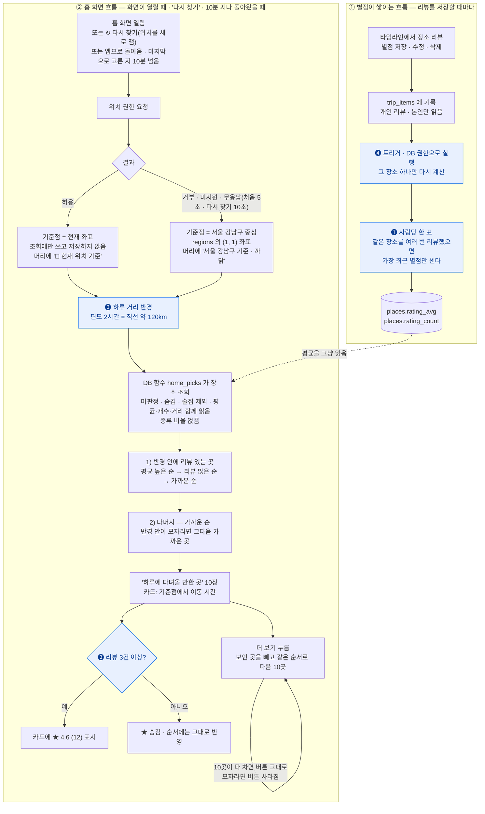

# 홈 — '하루에 다녀올 만한 곳'

> 다른 화면: [지도](지도.md) · [추천](추천.md) · [새 여행 만들기](여행-만들기.md) · [동선 최적화](동선-최적화.md) · [장소 업데이트](장소-업데이트.md) · [목록](../README-플로챠트.md)
>
> 홈 화면 '하루에 다녀올 만한 곳' 섹션이 장소를 고르는 방식(처음 10곳 · 더 보기마다 10곳)과,
> 그 순서에 쓰는 별점 집계입니다.
>
> 결정 ❶~❹ 그대로 구현돼 있습니다(❺ 종류별 자리는 없앴습니다 — 아래).
> DB 는 `supabase/migrations/20261015000000_home_picks_no_mix.sql` 의 `home_picks()`
> (별점 칸 · 트리거는 `20261008010000_place_ratings_and_home_picks.sql`),
> 화면은 `src/pages/HomePage.tsx`, 조회는 `places.homePicks()`(`src/lib/db.ts`).

## 흐름

### 규칙 한눈에

| # | 규칙 | 값 |
|---|---|---|
| 1 | 기준점 | 현재 위치. 거부 · 미지원 · 5초 무응답이면 서울 강남구 중심. 어느 쪽인지 섹션 머리에 보이고 '↻ 다시 찾기'로 새로 잰다 |
| 2 | 후보 | 미판정 장소 · 숨긴 장소(`hidden_at`) · 술집 제외 |
| 3 | 개수 | 처음 **10곳**. 종류 비율 없음(예전 ❺ 명소 3 · 밥집 1 · 카페 1 은 없앴다) |
| 4 | 1순위 | 하루 거리(직선 120km) 안에서 리뷰 있는 곳 — 평균 높은 순 → 리뷰 많은 순 → 가까운 순 |
| 5 | 2순위 | 나머지 — 기준점에서 가까운 순(거리 제한 없음) |
| 6 | 카드 줄 순서 | 고른 순서 그대로(1순위 → 2순위) |
| 7 | ★ 표시 | 리뷰 3건 이상일 때만. 1~2건도 순서에는 반영. 홈 · 장소 상세 · 지도 시트 · 추천 장소가 같은 규칙(`shownRating()`) |
| 8 | 별점 집계 | 사람당 가장 최근 한 표, 리뷰가 바뀔 때마다 트리거가 계산 |
| 8-1 | 더 보기 | 목록 아래 '더 보기 · 지금 N곳' — 누를 때마다 같은 순서로 다음 **10곳**. 이미 보인 곳을 빼고 고른다. 기준점은 처음 고른 자리. 10곳이 다 안 차면 버튼이 사라진다. '↻ 다시 찾기' · 10분 지나 다시 고르면 처음 10곳으로 돌아감 |
| 8-2 | 돌아오기 | 장소 상세 등에 갔다가 뒤로 오면 마지막 목록(더 보기로 늘린 것까지) · 기준점을 그대로 쓰고 위치를 다시 재지 않는다 — 고른 지 10분 안일 때만(넘으면 다시 고름). 스크롤도 떠날 때 자리로(`ScrollMemory`, 앱 전체 공통). 앱을 켜 둔 동안만 기억(10/10) |
| 9 | 이동 시간 | 도로 = 직선 × 1.3. 걸어서 15분 안이면 '도보'(4km/h), 아니면 '차로' — 처음 10km 는 30km/h, 나머지는 80km/h. 30분 넘으면 5분 단위 |

두 흐름이 만나는 곳은 점선 한 줄입니다. 홈은 다른 사람의 리뷰를 읽지 않고, 미리
계산해 둔 장소 평균만 읽습니다. 개별 리뷰는 `trip_items` 밖으로 나가지 않습니다.

## 확정한 결정

- **❶ 사람당 한 표** — 같은 사람이 같은 장소에 여러 번 별점을 주면 가장 최근 것만
  평균에 들어갑니다. 한 사람이 같은 곳을 여러 번 리뷰해 평균을 혼자 끌어올리지
  못하게 합니다.
- **❷ 하루 거리** — 편도 2시간, 직선 약 120km. 리뷰 있는 장소가 앞에 서는 범위입니다.
  남은 자리는 거리순이라 반경 안이 모자라면 그다음 가까운 곳이 이어서 들어옵니다.
  앱의 기존 이동 속도(차 30km/h)는 하루 일정 안의 시내 이동용이라 쓰지 않습니다.
  그대로 쓰면 반경이 46km 로 너무 좁습니다. 도시 사이 이동은 평균 80km/h ·
  우회 계수 1.3 으로 잡았습니다.
- **❸ ★ 표시** — 리뷰 3건 이상인 장소만 카드에 별점을 보입니다. 1~2건인 장소도
  순서에는 반영됩니다. 리뷰가 1건뿐이면 평균이 곧 그 사람의 별점이라서입니다.
- **❹ 트리거로 계산** — 리뷰가 바뀔 때마다 DB 트리거가 그 장소의 평균·개수를 다시
  계산해 `places` 에 저장합니다. 이유와 다른 방식을 택하지 않은 까닭은 아래에 있습니다.

그 밖에 정한 것:

- 위치 권한은 화면이 열릴 때 바로 묻습니다. 거부 · 미지원 · 5초 안에 응답이 없으면
  서울 강남구 중심을 기준점으로 삼아 **같은 흐름을 그대로** 탑니다.
- **기준을 보여 주고 다시 찾게 합니다.** 섹션 머리에 '📍 현재 위치 기준' 또는 '서울 강남구
  기준 · 위치 권한이 꺼져 있어요(찾지 못했어요)'가 보이고, '↻ 다시 찾기'는 브라우저가 기억한
  위치를 쓰지 않고 새로 재서(10초까지 기다림) 다시 고릅니다 — 권한 창에서 5초 넘게 늦게
  허용했거나, 거부했다가 설정에서 허용했거나, 자리를 옮긴 경우를 위해서입니다. 권한이 꺼져
  있으면 브라우저가 다시 묻지 않으므로 설정에서 켜는 법을 한 줄 덧붙입니다. 다시 고르는
  동안 지금 카드는 그대로 둡니다.
- 앱으로 돌아왔을 때 마지막으로 고른 지 **10분**이 지났으면 저절로 다시 고릅니다.
- 강남 좌표는 코드에 적지 않고 `regions` 의 (서울 1, 강남구 1) 행에서 읽습니다.
- 리뷰 없는 자리는 **가까운 순**으로 채웁니다. 같은 기준점이면 늘 같은 곳이 나오는 것은
  받아들였습니다.
- **~~❺ 종류별 자리~~ (없앰, 10/9)** — 예전에는 명소 3 · 밥집 1 · 카페 1 로 나눠 5곳을
  골랐습니다(가까운 순으로만 고르면 반경 수백 m 안의 식당·카페만 나와 동네 맛집 목록이
  돼서). 이제 비율 없이 한 줄 순서로 10곳씩 보이고 '더 보기'로 이어 봅니다. 그래서 리뷰가
  없는 동안은 기준점 가까운 밥집 · 카페가 앞에 많이 섭니다. 술집은 계속 넣지 않습니다.
- 사용자 평균은 `rating_avg` · `rating_count` 에 둡니다. TourAPI 는 평점을 주지 않습니다.
- 화면 이름은 '하루에 다녀올 만한 곳'입니다 — 인기 순위가 아니라 거리와 리뷰로 고르기 때문입니다.

## ❹ 별점은 트리거로 계산한다

계산 로직(사람당 한 표로 평균·개수)은 SQL 함수 하나이고, 갈리는 것은 그 함수를
언제 부르느냐였습니다. **가. 트리거**로 정했습니다.

| 언제 부르나 | 평균이 틀어질 수 있나 | 메모 |
|---|---|---|
| **가. 트리거** — 리뷰가 바뀔 때마다 ✅ | 아니오 | 위 흐름도의 ① 묶음. 코스 만족도가 이미 같은 방식 |
| 나. 읽을 때 계산 — 저장 칸 없이 조회 함수 안에서 | 아니오 | 평균이 필요한 화면마다 같은 계산을 돎 |
| 다. 앱이 저장 뒤에 호출 | 예 | 여행 삭제 · 탈퇴 · 장소 삭제로 리뷰가 지워질 때 놓침 |
| 라. 브라우저가 직접 계산해 저장 | 예 | 남의 리뷰를 못 읽고(RLS), `places` 쓰기를 열어야 해 위조 가능 |

트리거를 고른 이유:

- **평균이 틀어지지 않습니다.** 리뷰는 화면에서 지울 때만 사라지지 않습니다. 여행을
  지우면 그 안의 리뷰가 함께 지워지고(cascade), 탈퇴하면 그 사람의 리뷰가 전부
  지워지고, 관리자가 장소를 지우면 그 장소의 리뷰도 지워집니다. 이 삭제들은 DB 안에서 일어나 앱
  코드가 알 수 없지만, 트리거는 모두 받습니다.
- **읽는 쪽이 단순해집니다.** 홈 · 추천 · 지도가 저장된 평균을 그냥 읽습니다.
- **이미 쓰는 방식입니다.** 코스 만족도(`shared_plans.rating_avg`)가 같은 트리거
  구조라, 같은 원칙으로 만들고 같은 방법으로 검증합니다.

지키는 것:

- 트리거 함수는 **DB 권한(security definer)으로 돌아야** 합니다. 저장한 사람의
  권한으로 돌면 RLS 때문에 그 사람 자신의 리뷰만으로 평균을 내는데, 오류 없이 틀린
  값이 들어갑니다. `search_path` 도 고정합니다.
- **그 장소 하나만** 다시 계산합니다. 별점이 바뀐 행의 `place_id` 로 범위를 좁히고,
  `trip_items_place_idx`(REVIEW-08 에서 넣은 외래키 인덱스)를 탑니다.
- 리뷰 저장 · 수정 · 삭제와 별점 칸 변경, 그리고 cascade 로 지워지는 경우를 모두
  받도록 `insert` · `update of rating` · `delete` 에 겁니다.
- 마이그레이션에서 **이미 남긴 리뷰로 한 번 채워 넣습니다.** 장소 반영(`load.mjs`)
  upsert 는 이 두 칸을 건드리지 않으므로 재수집해도 평균이 사라지지 않습니다.
- 데모 모드는 DB · 트리거가 없으니 **읽을 때** 기기에 저장된 리뷰로 같은 계산
  (사람당 최근 한 표)을 합니다. 데모 리뷰는 한 기기 안에서만 있어 미리 저장해 둘
  이유가 없습니다.

## 구현 메모

| 무엇 | 어디 |
|---|---|
| 평균 · 개수 칸 | `places.rating_avg`(소수 1자리, 없으면 null) · `places.rating_count`(기본 0) |
| 계산 함수 | `place_rating_recompute(장소 id)` — definer, 아무에게도 실행 권한 없음 |
| 트리거 | `trip_items` 의 insert · delete · `rating`/`place_id` 변경, `trips.trip_date` 변경(최근 한 표가 바뀔 수 있음) |
| 홈 목록 | `home_picks(위도, 경도, 개수, 보인 id 들)`(`20261015000000`) — 비회원도 실행. 처음은 보인 곳 없이 10곳, 더 보기는 보인 곳을 빼고 다음 10곳(쪽 번호 대신 제외 목록 — 빠짐 · 겹침 없음). id 와 순서만 돌려주고 장소 행은 앱이 따로 읽음. 인자 이름 · 순서는 예전(위도, 경도, 개수) 그대로라 DB 를 먼저 올려도 옛 앱이 돈다 |
| 거리 | `distance_km()` — 하버사인, 앱의 `distanceKm()` 와 같은 식. `home_picks()` 가 호출자 권한으로 부르므로 anon · authenticated 에 실행 권한을 명시(`20261008030000`) |
| 위치 | `locate()`(`src/lib/geo.ts`) — 위치와 못 얻은 까닭(거부 · 시간 초과 · 미지원). 권한 창이 떠 있는 동안 브라우저 타임아웃이 멈추므로 타이머를 따로 겁니다(처음 5초 · 다시 찾기 10초). 다시 찾기는 `maximumAge 0`. 버튼은 홈 '↻ 다시 찾기', 지도 '↻ 내 위치 다시 찾기'(찾는 동안 둘 다 '찾는 중…') |
| 이동 시간 | `dayTripTravel()`(`src/lib/geo.ts`) — 규칙 9 |
| 장소 목록 | `places.list()` — API 가 한 번에 1,000행만 주므로 첫 쪽에서 전체 개수를 받고 나머지 쪽을 나눠 받음. 홈은 이 목록을 쓰지 않고 `home_picks()` 로 10곳씩 받음. 지도는 화면 안 100곳 넘으면 '+N' 대표로 묶어 그림 |
| 지도 내 위치 주변 | `places_nearest()` — [지도](지도.md) |

알려진 한계:

- 이동 시간은 직선 거리로 추정한 값입니다. 길 찾기 API 를 쓰지 않습니다. 반경 끝
  (직선 120km)은 카드에 '차로 약 2시간 10분'으로 나옵니다 — 처음 10km 를 시내
  속도로 잡으면서 '편도 2시간'보다 조금 길게 계산됩니다. 반경은 그대로 둡니다.
- 같은 자리에서 열면 늘 같은 열 곳입니다. 리뷰가 쌓이면 리뷰 있는 곳이 앞에 섭니다.
